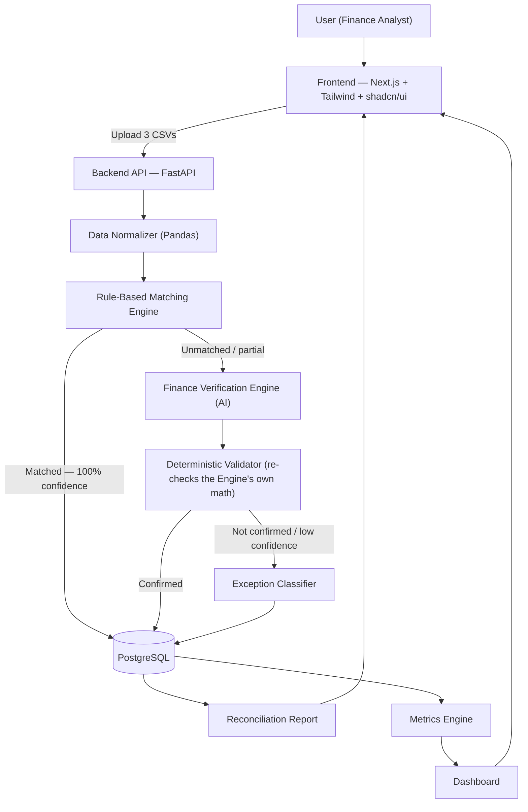

# 03 — System Architecture
## ReconPilot

## 1. High-Level Architecture



## 2. Component Interactions

| Component | Responsibility | Interface (conceptual) |
|---|---|---|
| Frontend | Upload UI, processing animation, dashboard, reconciliation table, exception report | Calls the REST API in 05-API-Spec.md |
| Data Normalizer | Parses 3 CSV schemas into one unified record schema | `normalize(file, source_type) -> DataFrame` |
| Rule Engine | Applies ordered deterministic rules | `match(records) -> [MatchResult]` |
| Finance Verification Engine | Explains rule-engine misses only (~5–10% of a batch) | `verify(candidate_pair) -> VerificationResult` |
| Deterministic Validator | Re-derives the AI's claimed math independently | `validate(verification) -> (bool, adjusted_confidence)` |
| Exception Classifier | Buckets unresolved records into 5 categories | `classify(record, context) -> ExceptionCategory` |
| Metrics Engine | Computes dashboard numbers per batch | `compute_metrics(batch_id) -> MetricsSnapshot` |

## 3. Data Flow (one record's journey)

1. A raw CSV row lands in `records` (tagged `source_type`) on upload, tied to a `batch_id`.
2. The Normalizer maps it into the unified schema — see 04-Database-Design.md.
3. The Rule Engine attempts each rule in order against candidate records from the other two sources. On a hit, a `matches` row is written with `match_method = 'rule'`, the rule name, and `confidence = 100`.
4. On a miss, the *nearest candidate* (or lack of one) is packaged as context and handed to the Finance Verification Engine.
5. The Engine returns structured JSON (see 06-AI-Design.md) — this is **never** written straight to the database. It first passes through the Deterministic Validator, which independently recomputes the claimed delta (e.g., does the claimed fee actually equal invoice − settlement?).
6. If validated, a `matches` row is written with `match_method = 'ai'`, the evidence, and an adjusted confidence score.
7. If not validated (or confidence falls under threshold), the record goes to the Exception Classifier instead, which writes an `exceptions` row with one of the 5 categories.
8. The Metrics Engine aggregates all of the above per batch into `metrics_snapshots`, which the dashboard reads.

## 4. Processing Pipeline

ReconPilot is a **batch pipeline, not a real-time stream** — a deliberate scope choice, not an oversight: a batch of 50–100+ records processing in 15–30 seconds does not need queueing infrastructure, and adding it would spend build time on plumbing instead of on the reconciliation logic actually being judged.

```
Upload (3 files) → validate schema → normalize → rule engine
  → [matched → DB]
  → [unmatched → AI verify → deterministic validate
       → confirmed → DB
       → not confirmed → exception classify → DB]
→ metrics computed → report + dashboard rendered
```

A future (post-Buildathon) version would move step 2 onward behind a job queue (e.g., Celery/RQ) for larger batches — noted here so it's an explicit "we know, and chose not to" rather than a gap.
