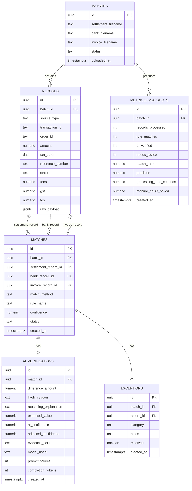

# 04 — Database Design
## ReconPilot (PostgreSQL)

## 1. ER Diagram



## 2. Tables

### `batches`
One row per upload session (one settlement + one bank + one invoice CSV).

| Column | Type | Notes |
|---|---|---|
| id | uuid, PK | |
| settlement_filename / bank_filename / invoice_filename | text | original filenames, for audit |
| status | text | `uploaded` → `processing` → `done` → `failed` |
| uploaded_at | timestamptz | |

### `records`
Every row from every source file, normalized to one schema.

| Column | Type | Notes |
|---|---|---|
| id | uuid, PK | |
| batch_id | uuid, FK → batches | |
| source_type | text | `settlement` \| `bank` \| `invoice` |
| transaction_id | text | |
| order_id | text | nullable — not every source has it |
| amount | numeric(14,2) | |
| txn_date | date | |
| reference_number | text | UTR-style bank reference, nullable |
| status | text | source-reported status |
| fees, gst, tds | numeric(14,2) | 0 where not applicable |
| raw_payload | jsonb | the original row, for audit / debugging |

### `matches`
One row per resolved (or attempted) match across up to three `records` rows.

| Column | Type | Notes |
|---|---|---|
| id | uuid, PK | |
| batch_id | uuid, FK | |
| settlement_record_id / bank_record_id / invoice_record_id | uuid, FK → records, nullable | nullable because not every match involves all three |
| match_method | text | `rule` \| `ai` |
| rule_name | text | populated only when `match_method = 'rule'` |
| confidence | numeric(5,2) | 100 for rule matches; adjusted score for AI matches |
| status | text | `matched` \| `exception` |
| created_at | timestamptz | |

### `ai_verifications`
One row per AI call that produced a structured verification — only exists for `matches.match_method = 'ai'`.

| Column | Type | Notes |
|---|---|---|
| id | uuid, PK | |
| match_id | uuid, FK → matches | |
| difference_amount | numeric(14,2) | |
| likely_reason | text | from the constrained reason enum — see 06-AI-Design.md |
| reasoning_explanation | text | 1–2 sentence natural-language explanation |
| expected_value | numeric(14,2) | what the AI claims the settlement *should* equal |
| ai_confidence | numeric(5,2) | the model's self-reported score |
| adjusted_confidence | numeric(5,2) | after the deterministic validator re-checks the math — this is the one the UI shows |
| evidence_field | text | which field(s) the explanation rests on |
| model_used | text | e.g. `gpt-5.6-terra`, `gemini-3.1-pro` |
| prompt_tokens / completion_tokens | int | for cost tracking, ties to 06-AI-Design.md cost estimates |
| created_at | timestamptz | |

### `exceptions`
One row per record that ends up in the exception report.

| Column | Type | Notes |
|---|---|---|
| id | uuid, PK | |
| match_id | uuid, FK, nullable | |
| record_id | uuid, FK → records | |
| category | text | `settlement_delay` \| `missing_credit` \| `duplicate_invoice` \| `refund_pending` \| `unknown` |
| notes | text | |
| resolved | boolean | default false — a reviewer can mark it resolved |
| created_at | timestamptz | |

### `metrics_snapshots`
One row per completed batch run — powers the dashboard directly, so the dashboard never has to recompute aggregates live.

| Column | Type | Notes |
|---|---|---|
| id | uuid, PK | |
| batch_id | uuid, FK | |
| records_processed | int | |
| rule_matches / ai_verified / needs_review | int | |
| match_rate / precision | numeric(5,2) | percentages |
| processing_time_seconds | numeric(8,2) | |
| manual_hours_saved | numeric(6,2) | |
| created_at | timestamptz | |

## 3. Relationships

- `batches` 1—N `records` (a batch has many records across 3 source types)
- `records` 1—N `matches` (a record participates in at most one match in practice, but the FK allows revisiting)
- `matches` 1—0/1 `ai_verifications` (only AI-method matches have one)
- `matches` 1—0/1 `exceptions` (only unresolved matches have one)
- `batches` 1—N `metrics_snapshots` (normally one per batch, but re-runs are kept, not overwritten, for audit)

## 4. Indexes

```sql
CREATE INDEX idx_records_batch_source ON records (batch_id, source_type);
CREATE INDEX idx_records_order_id ON records (order_id);
CREATE INDEX idx_records_reference_number ON records (reference_number);
CREATE INDEX idx_matches_batch_status ON matches (batch_id, status);
CREATE INDEX idx_exceptions_category ON exceptions (category);
```

`order_id` and `reference_number` are indexed because the rule engine's first two passes join on exactly these — that's the hot path.

## 5. Sample Data

`records` (abridged):

| id | batch_id | source_type | order_id | amount | reference_number | fees | gst | tds |
|---|---|---|---|---|---|---|---|---|
| r1 | b1 | invoice | ORD1042 | 12000.00 | — | 0 | 0 | 0 |
| r2 | b1 | settlement | ORD1042 | 11970.00 | UTR2026081234 | 30.00 | 0 | 0 |
| r3 | b1 | bank | — | 11970.00 | UTR2026081234 | 0 | 0 | 0 |

`matches` (rules matched settlement↔bank on UTR at 100%; invoice↔settlement needed AI):

| match id | settlement_record_id | invoice_record_id | match_method | confidence |
|---|---|---|---|---|
| m1 | r2 | r1 | ai | 99.0 |

`ai_verifications` for `m1`:

| match_id | difference_amount | likely_reason | expected_value | ai_confidence | adjusted_confidence | evidence_field |
|---|---|---|---|---|---|---|
| m1 | 30.00 | processing_fee | 11970.00 | 98.0 | 99.0 | settlement.fees |
