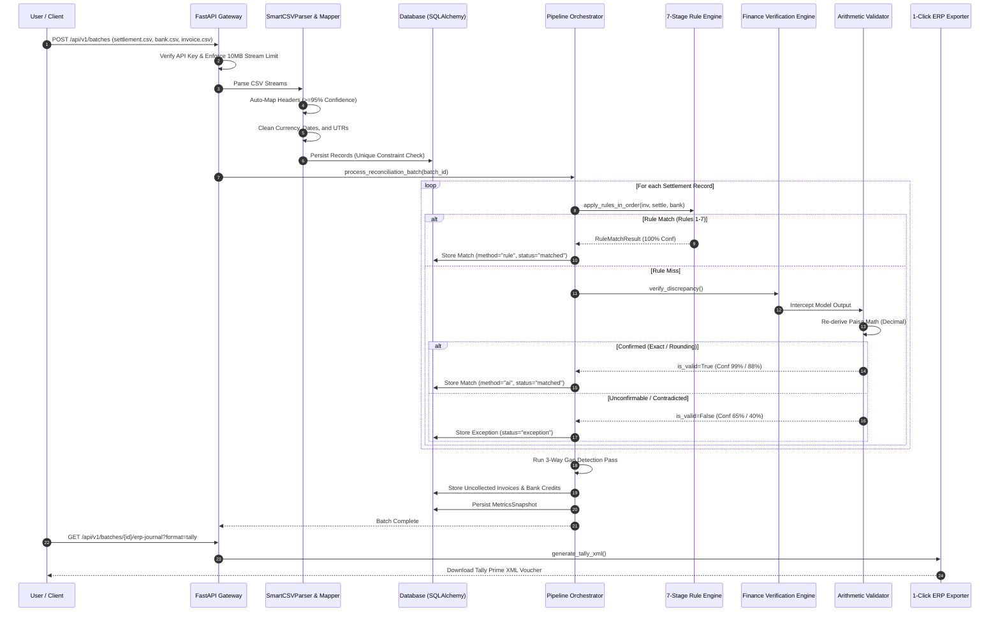

# ReconPilot 2.0 — Internal Developer & Engineering Guide
## Comprehensive File-by-File Architecture, Data Flows, Rule Specifications, and Verification Mechanics

> **Audience**: Staff Engineers, Core Maintainers, System Architects, and Technical Auditors.  
> **Document Version**: 2.1.0 (Developer & Engineering Reference)  
> **Evaluation Date**: September 4, 2026  
> **Last Verified Against Commit**: `15a6ae4`  
> **Scope**: Strict, verified documentation of the active implementation. Every package, file, data flow, validation step, deterministic rule, AI interaction, database transaction, and background job described herein is derived directly from the active code in this repository.

---

## Table of Contents

1. [Architectural Overview & Core Data Flow](#1-architectural-overview--core-data-flow)
2. [File-by-File Repository Breakdown](#2-file-by-file-repository-breakdown)
   - [2.1 Root & DevOps](#21-root--devops)
   - [2.2 Backend Core (`backend/`)](#22-backend-core-backend)
   - [2.3 API Gateway & Security (`backend/api/`)](#23-api-gateway--security-backendapi)
   - [2.4 Database & Persistence (`backend/db/`)](#24-database--persistence-backenddb)
   - [2.5 Ingestion, Parsing & Normalization (`backend/parser/`, `backend/normalizer/`, `backend/schema_mapper/`)](#25-ingestion-parsing--normalization)
   - [2.6 Deterministic Rule Engine & Exception Taxonomy (`backend/rules/`)](#26-deterministic-rule-engine--exception-taxonomy-backendrules)
   - [2.7 AI Verification Engine & Math Validator (`backend/ai/`)](#27-ai-verification-engine--math-validator-backendai)
   - [2.8 Services, Pipeline & Job Queue (`backend/services/`)](#28-services-pipeline--job-queue-backendservices)
   - [2.9 Analytics & Reports (`backend/analytics/`, `backend/reports/`)](#29-analytics--reports-backendanalytics-backendreports)
   - [2.10 Integrations & Adapters (`backend/integrations/`)](#210-integrations--adapters-backendintegrations)
   - [2.11 Synthetic Data & Archetypes (`backend/synthetic_data/`)](#211-synthetic-data--archetypes-backendsynthetic_data)
   - [2.12 Evaluation Pipeline (`backend/evaluation/`)](#212-evaluation-pipeline-backendevaluation)
   - [2.13 Frontend Architecture (`frontend/`)](#213-frontend-architecture-frontend)
   - [2.14 Test Suite (`tests/`)](#214-test-suite-tests)
3. [Data Flow: Ingestion to ERP Export](#3-data-flow-ingestion-to-erp-export)
4. [Data Validation & Sanitization Pipeline](#4-data-validation--sanitization-pipeline)
5. [The 7-Stage Deterministic Rule Engine: Deep Dive](#5-the-7-stage-deterministic-rule-engine-deep-dive)
6. [Finance Verification Engine & Independent Math Validation](#6-finance-verification-engine--independent-math-validation)
7. [Active Feedback Memory Store & Precedent Learning](#7-active-feedback-memory-store--precedent-learning)
8. [Database Schema, Indexing & Multi-Tenancy](#8-database-schema-indexing--multi-tenancy)
9. [Asynchronous Background Job Queue](#9-asynchronous-background-job-queue)
10. [REST API Layer, Rate Limiting & Security Safeguards](#10-rest-api-layer-rate-limiting--security-safeguards)
11. [Error Handling & Resilience Architecture](#11-error-handling--resilience-architecture)
12. [Verified Engineering Limitations & Boundary Conditions](#12-verified-engineering-limitations--boundary-conditions)

---

## 1. Architectural Overview & Core Data Flow

ReconPilot reconciles three financial streams:
- **ERP / Sales Invoices**: Gross amounts billed to customers (`amount`, `invoice_date`, `order_id`, `status`).
- **Payment Gateway Settlements**: Net amounts disbursed by Razorpay after deducting MDR fees, GST on fees, and Section 194-O TDS (`amount`, `settlement_date`, `order_id`, `reference_number`, `fees`, `gst`, `tds`).
- **Commercial Bank Statements**: Lump-sum credit payouts deposited into merchant core banking accounts (`amount`, `txn_date`, `reference_number`, `balance`).

### Core Architectural Decisions
1. **Deterministic Priority (Rules Before AI)**: Deterministic business rules execute first. AI verification only evaluates records that fail deterministic rules.
2. **Independent Arithmetic Validation**: The LLM's self-reported confidence is discarded. The engine re-derives the claim mathematically using Python `Decimal` to the exact paisa (₹0.01).
3. **Active Feedback Memory**: Human review decisions are persisted to dynamic storage to boost automated confidence on identical or similar recurring discrepancies.
4. **Multi-Tenancy**: All database tables enforce tenant isolation via `org_id`.
5. **Streaming DOS Protection**: Chunk-bounded streams enforce a 10MB upload ceiling per file before memory buffering.

---

## 2. File-by-File Repository Breakdown

### 2.1 Root & DevOps

#### `Dockerfile`
- **Location**: Root directory.
- **Base Image**: `python:3.12-slim`.
- **Function**: Builds the backend production container. Installs `build-essential`, `libpq-dev`, `curl`. Copies `requirements.txt`, installs dependencies, copies backend code, sets `PORT=8000`, `RECONPILOT_AI_MODE=offline`.
- **Healthcheck**: Probes `http://localhost:8000/api/v1/health` every 10s.

#### `docker-compose.yml`
- **Location**: Root directory.
- **Services**:
  1. `db`: `postgres:16-alpine`, port 5432, healthcheck via `pg_isready`.
  2. `backend`: Builds `./Dockerfile`, depends on healthy `db`, port 8000, environment config for `DATABASE_URL`.
  3. `frontend`: Builds `./frontend/Dockerfile`, depends on `backend`, port 3000, sets `NEXT_PUBLIC_API_URL=http://localhost:8000`.

#### `requirements.txt`
- **Location**: Root directory.
- **Dependencies**: `fastapi>=0.115.0`, `uvicorn[standard]>=0.31.0`, `pydantic>=2.9.0`, `pydantic-settings>=2.5.0`, `sqlalchemy>=2.0.35`, `psycopg2-binary>=2.9.9`, `pandas>=2.2.0`, `python-dotenv>=1.0.1`, `httpx>=0.27.2`, `python-multipart>=0.0.12`, `pytest>=8.3.3`, `pytest-cov>=5.0.0`, `alembic>=1.13.0`.

#### `pytest.ini`
- **Location**: Root directory.
- **Configuration**: Sets `testpaths = tests`, default flags `-v --tb=short --cov=backend --cov-report=term-missing`.

#### `alembic.ini`
- **Location**: Root directory.
- **Function**: Configuration for database schema migrations via Alembic.

#### `.github/workflows/ci.yml`
- **Location**: `.github/workflows/`
- **Jobs**:
  1. `backend-test`: Ubuntu runner, Python 3.12, installs `libpq-dev`, sets `RECONPILOT_AI_MODE=offline`, runs `pytest -m "not live_llm" --cov=backend --cov-report=xml:coverage.xml`, uploads artifact.
  2. `frontend-build`: Node.js 20, runs `npm ci` and `npm run build` in `frontend/`.
  3. `docker-validate`: Builds backend and frontend Docker images without pushing.

---

### 2.2 Backend Core (`backend/`)

#### `backend/main.py`
- **Entrypoint**: Configures FastAPI application instance (`title="ReconPilot API"`, `version="1.0.0"`).
- **Lifespan**: Initializes database schema via `init_db()` upon startup.
- **Middleware**: Mounts `RateLimiterMiddleware` (120 req/min) and `CORSMiddleware` (configurable via `CORS_ORIGINS`).
- **Health Check**: `GET /health` root health check for load balancers and container orchestrators.
- **Router**: Mounts `api_router` from `backend.api.routes`.

#### `backend/logging_config.py`
- **Function**: Standardizes logging across all modules using `logging.Formatter` (`%(asctime)s | %(levelname)-8s | %(name)s:%(funcName)s:%(lineno)d - %(message)s`).
- **Helper**: `get_logger(name)` returns named loggers under the `reconpilot` namespace.

---

### 2.3 API Gateway & Security (`backend/api/`)

#### `backend/api/routes.py`
- **Function**: Core REST controller hosting all 17 public endpoints.
- **DoS Guard**: `_read_validated_file` safely reads file streams up to `MAX_FILE_SIZE_BYTES = 10MB` using chunked reads (`max_size + 1`) to prevent Out-Of-Memory exhaustion.
- **Endpoints**:
  - `GET /api/v1/health`: Checks database connectivity (`SELECT 1`).
  - `GET /api/v1/merchants`: Returns metadata for all 10 registered merchant archetypes.
  - `POST /api/v1/schema/preview`: Returns schema mapping confidence tiers (`auto_map`, `suggest`, `reject`).
  - `POST /api/v1/batches`: Accepts 3 CSVs (settlement, bank, invoice), parses, normalizes, persists, and reconciles.
  - `POST /api/v1/batches/generate`: On-demand scalable batch generation (100 to 10,000 records).
  - `POST /api/v1/batches/demo`: Pre-configured demo run against 100-row Retail dataset.
  - `GET /api/v1/batches/{id}`: Batch metadata, status, and record count.
  - `GET /api/v1/batches/{id}/matches`: Paginated match list optimized with single batch record map lookup to eliminate N+1 queries.
  - `GET /api/v1/matches/{id}`: Match detail, calculation trace, AI telemetry, and similar past cases.
  - `GET /api/v1/batches/{id}/exceptions`: Exception classification report grouped by taxonomy.
  - `GET /api/v1/batches/{id}/metrics`: Headline KPIs and confusion matrix.
  - `POST /api/v1/matches/{id}/review`: Resolves exception and writes resolution into Feedback Memory.
  - `GET /api/v1/batches/{id}/export`: Exports standard reconciliation audit report as CSV.
  - `POST /api/v1/auth/token`: Generates signed HMAC-SHA256 JWT access token.
  - `POST /api/v1/reconciliation/jobs`: Submits batch for asynchronous background execution.
  - `GET /api/v1/reconciliation/jobs/{id}`: Polls real-time progress of background worker job.
  - `GET /api/v1/batches/{id}/erp-journal`: Exports accounting entries (`tally`, `zoho`, `netsuite`).
  - `GET /api/v1/batches/{id}/cash-position`: Treasury cash position and working capital analytics.

#### `backend/api/schemas.py`
- **Function**: Typed Pydantic request/response data contracts.
- **Models**: `ReviewMatchRequest`, `ReviewMatchResponse`, `BatchStatusResponse`, `GeneratedBatchResponse`, `BatchUploadResponse`, `MatchSummaryItem`, `PaginatedMatchesResponse`, `MerchantMetadataResponse`.

#### `backend/api/auth.py`
- **Function**: Authentication, token signing, and multi-tenant scoping.
- **JWT Signing**: `create_access_token` signs payloads with HMAC-SHA256 (`HS256`) using `JWT_SECRET` with 24-hour expiration.
- **JWT Decoding**: `decode_access_token` verifies signature and expiration timestamp.
- **API Key Guard**: `verify_api_key` validates `X-API-Key` or `Authorization: Bearer <key>` against `DEMO_API_KEY` or `RECONPILOT_API_KEY`.
- **Tenant Scoping**: `get_current_tenant` extracts tenant identifier from JWT claims (`org_id`, `tenant_id`, `sub`) or `X-Tenant-ID` header, defaulting to `"org_default"`.

#### `backend/api/rate_limiter.py`
- **Class**: `RateLimiterMiddleware(BaseHTTPMiddleware)`.
- **Mechanism**: In-memory sliding window tracking request timestamps per client IP.
- **Capacity**: 120 requests/minute. Exceeding limits returns `HTTP 429 Too Many Requests` with a `Retry-After` header.

---

### 2.4 Database & Persistence (`backend/db/`)

#### `backend/db/models.py`
Defines 8 SQLAlchemy ORM models inheriting from `declarative_base()`:
1. `Batch` (`batches`): `id` (UUID PK), `org_id`, filenames, `status` (`uploaded`, `processing`, `done`, `failed`), `uploaded_at`.
2. `Record` (`records`): `id` (UUID PK), `org_id`, `batch_id` (FK), `source_type` (`invoice`, `settlement`, `bank`), `transaction_id`, `order_id`, `amount`, `currency`, `fx_rate`, `txn_date`, `reference_number`, `status`, `fees`, `gst`, `tds`, `raw_payload`. Unique constraint on `(batch_id, transaction_id, source_type)`.
3. `Match` (`matches`): `id` (UUID PK), `org_id`, `batch_id` (FK), `settlement_record_id` (FK), `bank_record_id` (FK), `invoice_record_id` (FK), `match_method` (`rule`, `ai`), `rule_name`, `confidence`, `status` (`matched`, `exception`), `created_at`.
4. `AIVerification` (`ai_verifications`): `id` (UUID PK), `match_id` (FK unique), `difference_amount`, `likely_reason`, `reasoning_explanation`, `expected_value`, `ai_confidence`, `adjusted_confidence`, `evidence_field`, `model_used`, `prompt_tokens`, `completion_tokens`.
5. `ExceptionRecord` (`exceptions`): `id` (UUID PK), `org_id`, `match_id` (FK), `record_id` (FK), `category`, `notes`, `resolved`, `created_at`.
6. `MetricsSnapshot` (`metrics_snapshots`): `id` (UUID PK), `org_id`, `batch_id` (FK), `records_processed`, `rule_matches`, `ai_verified`, `needs_review`, `match_rate`, `precision`, `recall`, `true_positives`, `false_positives`, `false_negatives`, `ai_accuracy`, `processing_time_seconds`, `manual_hours_saved`.
7. `FeedbackMemoryRecord` (`feedback_memory`): `id` (UUID PK), `org_id`, `merchant_type`, `order_id`, `discrepancy_pattern`, `original_ai_reason`, `corrected_reason`, `amount_delta`, `evidence_field`, `reviewer_notes`, `reviewer_action`, `confidence_boost`.
8. `ReconciliationJob` (`reconciliation_jobs`): `id` (UUID PK), `org_id`, `batch_id` (FK), `status`, `stage`, `progress`, `created_at`, `updated_at`, `completed_at`, `result_payload`, `error_message`.

#### `backend/db/session.py`
- **`get_database_url()`**: Inspects `DATABASE_URL`, normalizes `postgres://` to `postgresql://`, checks discrete `POSTGRES_*` environment variables, and falls back to `sqlite:///./reconpilot.db`.
- **Engine Setup**: Instantiates SQLAlchemy engine with `pool_pre_ping=True`. If SQLite is detected, configures `connect_args={"check_same_thread": False}`.
- **`init_db()`**: Executes `Base.metadata.create_all(bind=engine)`. Includes a dynamic migration routine on SQLite to auto-add missing columns (e.g. `org_id`).
- **`get_db()`**: FastAPI dependency providing transactional session scope with automatic closing.

---

### 2.5 Ingestion, Parsing & Normalization

#### `backend/parser/csv_parser.py`
- **`EXPECTED_COLUMNS`**: Specifies canonical schemas:
  - `invoice`: `invoice_id`, `order_id`, `amount`, `invoice_date`, `customer_name`, `status`.
  - `settlement`: `settlement_id`, `order_id`, `amount`, `settlement_date`, `reference_number`, `status`, `fees`, `gst`, `tds`.
  - `bank`: `bank_txn_id`, `txn_date`, `description`, `reference_number`, `amount`, `balance`, `status`.
- **`BaseCSVParser`**: Abstract parser enforcing `validate_schema()`. Missing required columns raise `SchemaValidationError`.
- **`SmartCSVParser`**: Automatically maps unknown or merchant-specific column names into canonical schema using `SchemaMapper`.

#### `backend/normalizer/data_cleaners.py`
- **`clean_currency()`**: Extracts numeric amounts from dirty strings, handles rupee symbols (`₹`, `Rs`, `INR`), dollar signs (`$`), localized commas (`12,000.00`), and negative accounting formats (`(120.00)` $\rightarrow$ `-120.00`).
- **`clean_date()`**: Parses mixed date formats (`%Y-%m-%d`, `%d/%m/%Y`, `%d-%m-%Y`, `%Y/%m/%d`, `%d-%b-%Y`, ISO timestamps) into standard Python `date`.
- **`clean_reference()`**: Strips non-alphanumeric punctuation from bank UTR numbers (`UTR/2026/08/12345` $\rightarrow$ `UTR20260812345`).
- **`clean_order_id()`**: Trims whitespace, removes special characters, and preserves order keys.
- **`clean_status()`**: Normalizes string statuses (`PAID`, `Success`, `captured` $\rightarrow$ `paid`; `Settled` $\rightarrow$ `settled`; `Credit` $\rightarrow$ `credited`).

#### `backend/normalizer/normalizer.py`
- **`NormalizedRecord`**: Pydantic schema mapping records to a uniform representation.
- **`normalize_record()`**: Directs dictionary rows to `normalize_invoice_row`, `normalize_settlement_row`, or `normalize_bank_row`.
- **`persist_normalized_records()`**: Persists normalized records into the database with duplicate transaction detection (`HTTP 409 Conflict`).

#### `backend/schema_mapper/mapper.py` & `aliases.py`
- **Confidence Tiers**:
  - `auto_map` ($\ge 0.95$): Applied automatically with 100% confidence.
  - `suggest` ($0.80 - 0.94$): Requires user confirmation in UI.
  - `reject` ($< 0.80$): Safely rejected without guessing.
- **`COLUMN_ALIASES`**: Pre-seeded dictionary of over 100 common financial column aliases (e.g. `payout_date`, `value_date`, `bank_ref_no`, `utr_number`, `gross_amount`).

---

### 2.6 Deterministic Rule Engine & Exception Taxonomy (`backend/rules/`)

#### `backend/rules/rule_engine.py`
- **Core Pipeline**: `apply_rules_in_order()` applies 7 rules sequentially.
- **Paisa Rounding**: `round_paisa(val)` quantizes values to `Decimal("0.01")` using `ROUND_HALF_UP`.
- **Duplicate Detection**: `find_duplicate_order_ids()` detects conflicting order IDs across invoices and routes them to exceptions.
- **`RuleMatchResult`**: Encapsulates `is_matched`, `rule_name`, `confidence`, and `charge_breakdown`.

#### `backend/rules/adjusted_amount.py`
- **`explain_fixed_schedule_deduction()`**: Derives expected MDR, GST, and TDS based on merchant configuration. Validates both arithmetic balance and compliance with the contractual rate schedule.

#### `backend/rules/exception_taxonomy.py`
- **Taxonomy Structure**: 8 domains, 30+ category definitions.
- **Metadata**: Each `ExceptionDefinition` defines `category_id`, `domain`, `display_title`, `description`, `suggested_action`, and `financial_impact` (`timing`, `shortfall`, `excess`, `statutory`, `dispute`).

---

### 2.7 AI Verification Engine & Math Validator (`backend/ai/`)

#### `backend/ai/engine.py`
- **`FinanceVerificationOrchestrator`**: Coordinates context assembly, precedent retrieval, LLM execution, math validation, and database audit persistence.
- **`assemble_context_payload()`**: Injects normalized records, precomputed numeric delta, merchant fee schedule, and matching historical precedents into `USER_PROMPT_TEMPLATE`.
- **Simulation Fallback**: `_simulate_llm_reasoning()` provides deterministic offline simulation for test suites and offline environments when `RECONPILOT_AI_MODE=offline`.

#### `backend/ai/validator.py`
- **`validate_finance_verification()`**: Intercepts LLM output and recalculates expected amounts.
- **Formulas Evaluated**:
  - `processing_fee`: $Invoice - Settlement.fees == Settlement.amount$
  - `gst_deduction`: $Invoice - (Settlement.fees + Settlement.gst) == Settlement.amount$
  - `tds_deduction`: $Invoice - (Settlement.fees + Settlement.gst + Settlement.tds) == Settlement.amount$
- **Verdicts**: Returns `exact` (99% conf), `rounding` (88% conf), `unconfirmable` (65% conf), or `contradicted` (40% conf).

#### `backend/ai/llm_client.py`
- **`LLMClient`**: Connects via HTTP to Google Gemini API (`generateContent`) or OpenAI Chat Completions API (`chat/completions`) using `httpx`.
- **Parameters**: `temperature=0.0`, strict JSON mode (`response_mime_type="application/json"` or `response_format={"type": "json_object"}`).
- **Retry Logic**: Exponential backoff up to 4 retries for transient HTTP/JSON decode errors.
- **Budget Ceiling**: Tracks cumulative USD spend. If spend exceeds `AI_SPEND_CEILING_USD`, raises `CostCeilingExceededError`.

#### `backend/ai/feedback_memory.py`
- **`FeedbackMemoryStore`**: Thread-safe in-memory cache synchronized with the `feedback_memory` database table.
- **Precedent Lookup**: `find_similar_cases()` matches merchant type and delta corridors ($\pm 20\%$).
- **Recording**: `record_feedback()` persists human approvals to prevent repetitive review of identical fee patterns.

#### `backend/ai/prompts.py`
- **`SYSTEM_PROMPT`**: Guides the AI to act as a forensic finance reconciliation engine under Section 194-O, MDR schedules, and GST guidelines.
- **`USER_PROMPT_TEMPLATE`**: Formats invoice JSON, settlement JSON, bank JSON, and rate card into a structured prompt.

---

### 2.8 Services, Pipeline & Job Queue (`backend/services/`)

#### `backend/services/pipeline.py`
- **`process_reconciliation_batch()`**: The primary reconciliation pipeline:
  1. Loads all batch records in a single query.
  2. Runs the 7-stage deterministic rule engine on each settlement.
  3. Routes residual misses to the Finance Verification Engine.
  4. Intercepts AI proposals with the arithmetic validator.
  5. Executes 3-way gap detection (uncollected invoices & unmatched bank credits).
  6. Computes confusion matrix and persists `MetricsSnapshot`.

#### `backend/services/job_queue.py`
- **`JobQueueManager`**: Implements an asynchronous worker pool using `concurrent.futures.ThreadPoolExecutor(max_workers=4)`.
- **Lifecycle**: `submit_job()` creates a `reconciliation_jobs` record and schedules background execution. `_run_job()` updates progress and stages (`queued` $\rightarrow$ `rule_matching` $\rightarrow$ `ai_micro_batching` $\rightarrow$ `gap_detection` $\rightarrow$ `snapshot` $\rightarrow$ `completed`).

#### `backend/services/metrics.py`
- **`compute_batch_metrics()`**: Calculates match rate, precision, recall, and manual hours saved ($Records \times 3.0 \text{ min} / 60$).

---

### 2.9 Analytics & Reports (`backend/analytics/`, `backend/reports/`)

#### `backend/analytics/cash_position.py`
- **`compute_cash_position()`**: Computes book cash balance, pending settlement inflows, pending refund/dispute reserves, expected cash tomorrow, and liquidity health index (0 to 100).

#### `backend/reports/reporter.py`
- **`generate_reconciliation_csv()`**: Formats reconciliation export containing record IDs, order IDs, confidence, and audit evidence.
- **`generate_tally_xml()`**: Generates Tally Prime XML `<ENVELOPE>` mapping transactions to Bank Account, Gateway Charges (MDR), Input GST, Discrepancy Suspense, and Gateway Clearing accounts.
- **`generate_zoho_books_csv()`**: Formats Zoho Books manual journal CSV import schema.
- **`generate_netsuite_journal_json()`**: Outputs NetSuite SuiteTalk JSON journal entries.

---

### 2.10 Integrations & Adapters (`backend/integrations/`)

#### `backend/integrations/base.py`
- Abstract contracts: `BaseGatewayAdapter` (gateways), `BaseBankAdapter` (banks), `BaseERPAdapter` (ERPs), `SyncResult`, `IntegrationMode` (`demo`, `production`).

#### `backend/integrations/gateways/razorpay.py`
- **`RazorpayAdapter`**:
  - Live Mode: Connects to `https://api.razorpay.com/v1/orders`, `/payments`, and `/settlements` using Basic Auth.
  - Demo Mode: Triggered by `rzp_test_` keys. Reconciles captured test payments and derives simulated bank statements for sandbox evaluation.

#### `backend/integrations/bank/hdfc.py`
- **`HDFCBankAdapter`**: Parses commercial HDFC Bank statement feeds into canonical bank records.

#### `backend/integrations/erp/tally.py`
- **`TallyERPAdapter`**: Ingests Tally sales register exports into canonical invoice records.

#### `backend/integrations/gateways/cashfree.py` & `stripe.py`
- Extensible adapter stubs for Cashfree AutoCollect and Stripe cross-border settlements.

---

### 2.11 Synthetic Data & Archetypes (`backend/synthetic_data/`)

#### `backend/synthetic_data/merchant_archetypes.py`
- Defines 10 industry profiles: `restaurant`, `marketplace`, `saas`, `travel`, `healthcare`, `retail`, `gaming`, `education`, `logistics`, `b2b`. Each archetype specifies custom column mappings, date formats, currency styles, ticket ranges, and typical exceptions.

#### `backend/synthetic_data/generator.py`
- Synthesizes realistic 3-way transaction datasets with randomized amounts, date lag, fees, GST, TDS, and ground-truth validation labels.

---

### 2.12 Evaluation Pipeline (`backend/evaluation/`)

#### `backend/evaluation/score.py`
- Official evaluation scoring script matching `07-Evaluation-Plan.md`. Runs the reconciliation pipeline on the labeled synthetic batch and calculates unrounded precision, recall, F1 score, and AI decision accuracy.

#### `backend/evaluation/evaluator.py`
- Helper evaluating confusion matrices and comparison against target thresholds.

#### `backend/evaluation/generate_adversarial_dataset.py`
- Generates complex edge cases, extreme variance, and multi-anomaly datasets for stress testing.

---

### 2.13 Frontend Architecture (`frontend/`)

- **`frontend/app/page.tsx`**: Main SPA dashboard managing active tabs (`dashboard`, `upload`, `matches`, `exceptions`), batch loading, and modal state.
- **`frontend/components/CashPositionBanner.tsx`**: Real-time display of confirmed bank balance, pipeline inflows, and expected cash tomorrow.
- **`frontend/components/MetricsCards.tsx`**: Headline KPI cards (Match rate, Precision, Recall, Hours saved).
- **`frontend/components/AnalyticsCharts.tsx`**: Recharts resolution distribution donut chart and exception category bar chart.
- **`frontend/components/UploadPanel.tsx`**: Drag-and-drop CSV upload zone, schema mapping preview, and instant archetype generator.
- **`frontend/components/MatchTable.tsx`**: Paginated match ledger with status, method, confidence, and amount filtering.
- **`frontend/components/EvidenceDrawer.tsx`**: Slide-out drawer displaying calculation trace, math validation verdict, model used, tokens, and historical past cases.
- **`frontend/components/ReviewModal.tsx`**: Human reviewer disposition modal storing audit notes and feedback precedents.
- **`frontend/components/ExceptionGrid.tsx`**: Domain-based exception taxonomy cards.

---

### 2.14 Test Suite (`tests/`)

The repository contains 25 test files:
- `test_adapters.py`: Gateway, bank, and ERP adapter sync and normalization tests.
- `test_adjusted_amount.py`: Deterministic MDR, GST, and TDS fee schedule verification.
- `test_ai_engine.py`: AI orchestrator, context building, and validator integration tests.
- `test_ai_live_benchmark.py`: Live unmocked LLM benchmark (`@pytest.mark.live_llm`).
- `test_api_health.py`: Healthcheck route and database probe tests.
- `test_auth_tenant.py`: HMAC-SHA256 JWT validation, API keys, and multi-tenant scoping.
- `test_cash_position.py`: Treasury balance and liquidity index tests.
- `test_data_cleaners.py`: Currency, date, status, and UTR sanitization tests.
- `test_erp_export.py`: Tally XML, Zoho CSV, and NetSuite JSON journal validation.
- `test_evaluation_score.py`: Precision, recall, and confusion matrix tests.
- `test_feedback_memory.py`: Precedent storage and dynamic confidence boost tests.
- `test_gap_detection.py`: Uncollected invoice and unmatched bank credit tests.
- `test_job_queue.py`: ThreadPoolExecutor background job progress tests.
- `test_live_metrics.py`: Metrics snapshot computation tests.
- `test_llm_client.py`: LLM client retries, cost calculation, and spend ceiling tests.
- `test_merchant_archetypes.py`: Validation across all 10 merchant archetypes.
- `test_micro_batching.py`: Batch slicing and micro-chunk processing tests.
- `test_parser_and_normalizer.py`: CSV parsing and unified record normalization tests.
- `test_rules.py`: Comprehensive test suite for all 7 deterministic rules.
- `test_safe_schema.py`: Safe schema mapping confidence thresholds.
- `test_scalability_10k.py`: High-volume 10,000-row batch scalability tests.
- `test_schema_mapper.py`: Column alias matching and remapping tests.
- `test_security.py`: Rate limiter, stream DOS, and header security tests.
- `test_synthetic_data.py`: Synthetic generator and scenario label tests.
- `test_validator.py`: Independent arithmetic validator verdicts (`exact`, `rounding`, `unconfirmable`, `contradicted`).

---

## 3. Data Flow: Ingestion to ERP Export



---

## 4. Data Validation & Sanitization Pipeline

Data sanitization occurs before records enter the database:

1. **Stream Boundary Check (`backend/api/routes.py`)**:
   `_read_validated_file` verifies `upload_file.size <= 10MB` and reads in bounded chunks (`max_size + 1`). Streams exceeding 10MB immediately raise `HTTP 413 Content Too Large`.
2. **Schema Gating (`backend/schema_mapper/mapper.py`)**:
   Incoming columns are mapped against canonical schemas. Confidence $\ge 0.95$ triggers auto-mapping; $0.80 - 0.94$ requires user confirmation; $< 0.80$ is safely rejected.
3. **Data Cleaning (`backend/normalizer/data_cleaners.py`)**:
   - Currency: Strips symbols (`₹`, `$`, `Rs`), cleans commas, parses negative parentheticals.
   - Date: Unifies 5 distinct date formats into standard Python `date`.
   - Reference: Sanitizes UTRs by removing slashes, hyphens, and whitespace.
   - Status: Normalizes statuses to canonical enums (`paid`, `settled`, `credited`).
4. **Persistence Integrity (`backend/normalizer/normalizer.py`)**:
   Records are inserted into the `records` table under a database `UniqueConstraint("batch_id", "transaction_id", "source_type")`. Duplicates abort with `HTTP 409 Conflict`.

---

## 5. The 7-Stage Deterministic Rule Engine: Deep Dive

Implemented in `backend/rules/rule_engine.py`:

### Rule 1: `match_exact_order_id`
- **Criteria**: `invoice.order_id == settlement.order_id`, `invoice.amount == settlement.amount`, `settlement.status == "settled"`, `invoice.status == "paid"`, date variance $\le 2$ days.
- **Guard**: Checks `find_duplicate_order_ids()`. If the invoice order ID appears multiple times in the invoice batch, matching is disallowed and the transaction is routed to exceptions.
- **Confidence**: `100.00%`.

### Rule 2: `match_exact_reference_number`
- **Criteria**: `settlement.reference_number == bank.reference_number`, `settlement.amount == bank.amount`, `settlement.status == "settled"`, `bank.status == "credited"`.
- **Confidence**: `100.00%`.

### Rule 3: `match_exact_amount`
- **Criteria**: `invoice.amount == settlement.amount`, settlement within T+2 days window, no reference number present.
- **Confidence**: `100.00%`.

### Rule 4: `settlement_date_window`
- **Criteria**: `invoice.amount == settlement.amount`, settlement date falls within extended corridor (T+3 to T+7 days).
- **Confidence**: `98.00%` (calibrated for weekend and bank holiday rollover).

### Rule 5: `match_fee_gst_tds_adjusted_amount`
- **Criteria**: Reconciles contractual fee deductions against configured rate cards:
  $$Expected Fee = \text{round\_paisa}(Invoice \times MDR)$$
  $$Expected GST = \text{round\_paisa}(Expected Fee \times GST)$$
  $$Expected TDS = \text{round\_paisa}(Invoice \times TDS)$$
  $$Expected Net = Invoice - (Fee + GST + TDS)$$
- **Guard**: All recorded deductions must agree with rate schedules. Non-standard manual fee adjustments fail this rule and route to AI.
- **Confidence**: `100.00%`.

### Rule 6: `match_tolerance_amount`
- **Criteria**: Order IDs match, net difference $0.00 < |Invoice - Settlement| \le ₹2.00$.
- **Confidence**: `95.00%`.

### Rule 7: `match_fx_spread_tolerance`
- **Criteria**: International cross-border order (`currency != "INR"` or `intl` in order ID), variance falls within standard currency conversion corridor ($0.5\% \le \Delta / Invoice \le 4.0\%$).
- **Confidence**: `94.00%`.

---

## 6. Finance Verification Engine & Independent Math Validation

Located in `backend/ai/`:

### Context Assembly (`backend/ai/engine.py`)
Prepares prompt data without requiring the model to perform mental arithmetic:
- Injects precomputed numeric delta: `abs(invoice.amount - settlement.amount)`.
- Injects merchant fee schedule parameters.
- Retrieves and appends similar historical precedents from Feedback Memory.

### LLM Client (`backend/ai/llm_client.py`)
- Executes HTTP calls to Google Gemini (`gemini-2.5-pro`) or OpenAI (`gpt-5.6-terra`).
- Enforces strict JSON schema output with `temperature=0.0`.
- Implements exponential backoff retries (1s, 2s, 4s, 8s).
- Tracks token consumption and enforces `AI_SPEND_CEILING_USD` (default \$5.00).

### Independent Arithmetic Validator (`backend/ai/validator.py`)
The model's output is intercepted before any database write:
```python
independently_expected = invoice.amount - deduction
reconciliation_error = abs(independently_expected - settlement.amount)
```
- **`exact`**: Error $\le ₹0.01$. Status: `matched`, Adjusted Confidence: `99.00%`, `requires_human_review = False`.
- **`rounding`**: Error $\le ₹2.00$. Status: `matched`, Adjusted Confidence: `88.00%`, `requires_human_review = False`.
- **`unconfirmable`**: Plausible non-equation claim (`settlement_delay`, `partial_refund`, `duplicate`). Status: `exception`, Adjusted Confidence: `65.00%`, `requires_human_review = True`.
- **`contradicted`**: Math fails or contradicts record amounts. Status: `exception`, Adjusted Confidence: `40.00%`, routed as `unknown_discrepancy`.

---

## 7. Active Feedback Memory Store & Precedent Learning

Implemented in `backend/ai/feedback_memory.py`:

```
┌────────────────────────────────┐
│   Human Controller Resolves    │
│    Exception in Dashboard      │
└───────────────┬────────────────┘
                │
                ▼
┌────────────────────────────────┐
│   POST /matches/{id}/review    │
│ (reviewer_note, corrected_cat) │
└───────────────┬────────────────┘
                │
                ▼
┌────────────────────────────────┐
│      feedback_memory Table     │
│  - merchant_type               │
│  - amount_delta                │
│  - corrected_reason            │
│  - reviewer_action             │
└───────────────┬────────────────┘
                │
                ▼ Future Discrepancies
┌────────────────────────────────┐
│     find_similar_cases()       │
│ - Matches merchant type        │
│ - Filters delta (±20% range)   │
│ - Injects into LLM prompt      │
│ - Boosts confidence (+5.00%)   │
└────────────────────────────────┘
```

---

## 8. Database Schema, Indexing & Multi-Tenancy

Implemented in `backend/db/models.py`:

### Multi-Tenancy Partitioning
All entities contain an `org_id` column indexed via `idx_<table_name>_org_id`. Multi-tenant queries filter by tenant partition key:
```python
query = db.query(Match).filter(Match.batch_id == batch_id, Match.org_id == tenant_id)
```

### Key Table Indexes
- `records`: `idx_records_batch_source`, `idx_records_order_id`, `idx_records_reference_number`, `idx_records_org_id`.
- `matches`: `idx_matches_batch_status`, `idx_matches_org_id`.
- `exceptions`: `idx_exceptions_category`, `idx_exceptions_org_id`.
- `feedback_memory`: `idx_feedback_merchant_pattern`, `idx_feedback_corrected_reason`, `idx_feedback_org_id`.
- `reconciliation_jobs`: `idx_jobs_batch_id`, `idx_jobs_status`, `idx_jobs_org_id`.

---

## 9. Asynchronous Background Job Queue

Implemented in `backend/services/job_queue.py`:

- **Concurrency Model**: `ThreadPoolExecutor(max_workers=4, thread_name_prefix="recon-worker")`.
- **State Management**: Thread-safe in-memory `JobProgress` dictionary synchronized with database `reconciliation_jobs` records.
- **Stage Progression**:
  1. `queued` (0%)
  2. `initializing` (10%)
  3. `rule_matching` (30%)
  4. `ai_micro_batching` (60%)
  5. `gap_detection` (80%)
  6. `snapshot` (95%)
  7. `completed` (100%)
- **API Interaction**:
  - `POST /api/v1/reconciliation/jobs`: Submits batch, returns `job_id`.
  - `GET /api/v1/reconciliation/jobs/{job_id}`: Polls real-time progress without blocking ASGI worker threads.

---

## 10. REST API Layer, Rate Limiting & Security Safeguards

Implemented in `backend/api/`:

### Rate Limiting (`backend/api/rate_limiter.py`)
- Middleware tracks IP hit rates in a 60-second sliding window.
- Exceeding 120 requests/minute returns `HTTP 429 Too Many Requests`. Health check routes (`/health`, `/api/v1/health`) and OpenAPI docs (`/docs`) are explicitly exempted.

### Authentication (`backend/api/auth.py`)
- `verify_api_key`: Checks `X-API-Key` or `Authorization: Bearer <key>`.
- `get_current_tenant`: Resolves organization context from JWT payload or `X-Tenant-ID`.

### N+1 Query Optimization (`backend/api/routes.py`)
In `GET /api/v1/batches/{batch_id}/matches`:
Instead of loading records per match in a loop, all record IDs for the paginated slice are collected and pre-fetched in a single database query:
```python
record_map = {r.id: r for r in db.query(Record).filter(Record.id.in_(record_ids)).all()}
```

---

## 11. Error Handling & Resilience Architecture

| HTTP Status | Error Scenario | Triggering Condition |
| :--- | :--- | :--- |
| **`400 Bad Request`** | Unparseable CSV / Missing Batch ID | Empty file, corrupted CSV format, or missing required payload keys. |
| **`401 Unauthorized`** | Missing or Invalid Credentials | Missing or incorrect API key, expired or tampered JWT signature. |
| **`404 Not Found`** | Resource Missing | Batch ID, Match ID, or Job ID does not exist in the database. |
| **`409 Conflict`** | Duplicate Ingestion | Transaction ID collision within the same batch and source type. |
| **`413 Content Too Large`** | Stream DOS Protection | Uploaded file size exceeds `MAX_FILE_SIZE_BYTES = 10MB`. |
| **`422 Unprocessable`** | Schema Validation Failure | Required CSV columns missing and unmappable by `SchemaMapper`. |
| **`429 Rate Limit Exceeded`** | Rate Limit Breach | Client IP exceeds 120 requests within a 60-second window. |

### AI Failure Resilience
If live LLM calls fail after 4 retries or breach the spend ceiling:
- The orchestrator falls back to deterministic simulation if available, or
- Marks the record as an unconfirmed exception (`cost_ceiling_exceeded` or `unknown_discrepancy`), ensuring zero unhandled pipeline crashes.

---

## 12. Verified Engineering Limitations & Boundary Conditions

1. **Commercial Banking Feeds**:
   Payment gateways provide programmatic REST APIs, but Indian commercial banks (HDFC, ICICI, SBI) restrict automated access to host-to-host SFTP batch networks. Direct statement imports currently process CSV/ASCII feeds.
2. **Unstructured PDF Statements**:
   ReconPilot requires structured CSV, JSON, or XML feeds. Scanned or non-searchable PDF bank statements require optical table pre-extraction.
3. **Database Dialect Parity**:
   The engine supports SQLite for local testing and PostgreSQL for production. SQLite lacks native `JSONB` indexing and concurrent write pooling. Production deployments should use PostgreSQL 16 Alpine.
4. **Memory Allocation**:
   The in-memory rate limiter and feedback store cache are local to each ASGI process. Multi-node horizontal scaling requires Redis-backed shared memory.
