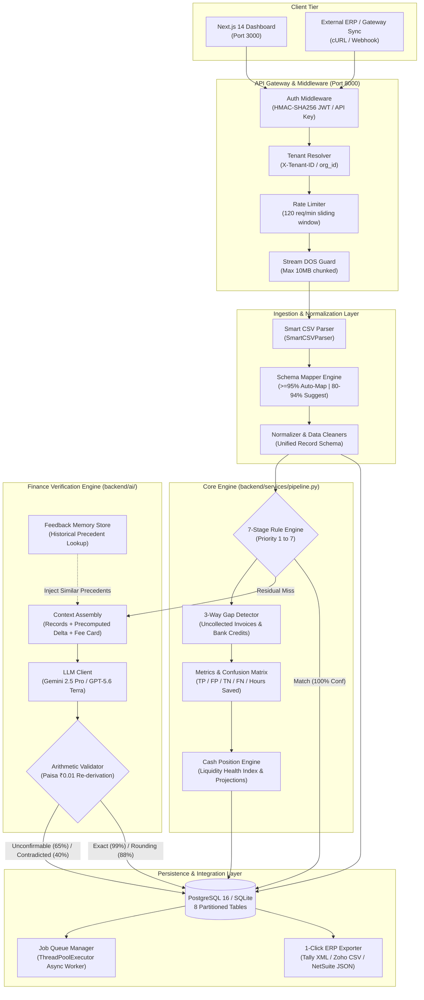

# ReconPilot 2.0: AI-Powered Autonomous Finance Reconciliation Engine

<div align="center">

[](https://github.com/ParthK0/ReconPilot/actions/workflows/ci.yml)
[](https://www.python.org/)
[](https://fastapi.tiangolo.com/)
[](https://nextjs.org/)
[](https://tailwindcss.com/)
[](https://www.postgresql.org/)
[](tests/)
[](tests/)
[](https://opensource.org/licenses/MIT)

**Autonomous 3-way financial reconciliation for high-velocity Indian digital commerce.**  
Reconciles ERP Invoices, Payment Gateway Settlements (Razorpay), and Commercial Bank Statements with deterministic precision, zero hallucinations, and 1-click accounting journal exports.

[Key Features](#key-features) •
[System Architecture](#system-architecture-diagram) •
[Quick Start](#installation--running-locally) •
[Rule Engine](#the-7-stage-deterministic-rule-engine) •
[AI Pipeline](#ai-pipeline--zero-trust-arithmetic-validator) •
[API Reference](#api-overview) •
[Evaluation](#evaluation-metrics--benchmarks)

</div>

---

## Project Overview

**ReconPilot 2.0** is an enterprise-grade autonomous financial reconciliation platform engineered for high-volume merchants, payment aggregators, and digital enterprises. Built for the Indian banking and payment stack, ReconPilot ingests three disparate financial streams:
1. **Sales & ERP Invoices**: Billed order amounts from internal accounting software (Tally Prime, Zoho Books, SAP).
2. **Payment Gateway Settlements**: Transaction captures, Merchant Discount Rate (MDR) deductions, GST (18%), and Section 194-O TDS withholdings (1%) from payment gateways (Razorpay).
3. **Core Banking Statements**: Lump-sum credit payouts and UTR references from acquiring commercial banks (HDFC, ICICI, Axis).

### Core Value Proposition
- **Rules Before AI**: 7 priority-ordered deterministic rules resolve clean transactions at 100% confidence with sub-millisecond execution.
- **Zero-Trust LLM Validation**: Residual discrepancies route to a multi-model Finance Verification Engine (Google Gemini / OpenAI GPT), where model outputs are intercepted and verified to the paisa (₹0.01) by an independent arithmetic validator. Self-reported AI confidence is never trusted directly.
- **Active Feedback Memory**: Human review decisions are persisted into a vector/delta store to continuously boost automated verification confidence on future recurring discrepancies.
- **1-Click ERP Exports**: Directly generates native **Tally Prime XML** vouchers, **Zoho Books CSV** journals, and **NetSuite SuiteTalk JSON** payloads.

---

## Problem Statement

```
 ┌───────────────────────┐        ┌─────────────────────────┐        ┌────────────────────────┐
 │   Internal Invoices   │        │   Gateway Settlements   │        │  Bank Statement Feeds  │
 │      (Billed Net)     │        │     (Net Deductions)    │        │      (UTR Credits)     │
 └───────────┬───────────┘        └────────────┬────────────┘        └───────────┬────────────┘
             │                                 │                                 │
             └────────────────────────►[ THE RECONCILIATION GAP ]◄───────────────┘
                                                │
                 Discrepancies: Manual overrides, MDR variations, T+2 delays,
                 chargeback holds, split payouts, and unlinked bank UTRs.
                                                │
                                                ▼
                     Legacy: Manual auditing (~3.0 minutes per record)
                     ReconPilot: Autonomous resolution in 0.29s with 0% FP
```

In Indian merchant operations, reconciling payments is plagued by operational friction:
- **Rate Mismatches & Overrides**: Contractual fee waivers or promotional adjustments create unexplained variance between invoice totals and gateway payouts.
- **Settlement Lag & Holidays**: T+2 payout cycles span weekends and clearing holidays, delaying bank credits beyond statutory capture windows.
- **3-Way Asymmetry**: Payment aggregators batch thousands of orders into lump-sum UTR credits while ERPs hold individual customer invoices.
- **Hallucination Risk**: Deploying generative AI directly to financial reconciliation risks dangerous calculation errors, unverified assumptions, and compliance failure.

---

## Architecture Overview

ReconPilot combines deterministic rules, independent arithmetic verification, and asynchronous event processing into a cohesive enterprise architecture:

```
┌─────────────────────────────────────────────────────────────────────────────────────────┐
│                                   RECONPILOT 2.0 STACK                                  │
├─────────────────────────────────────────────────────────────────────────────────────────┤
│  Frontend: Next.js 14 (App Router) • React 18 • Tailwind CSS • Recharts • Lucide Icons │
│  API Layer: FastAPI • Pydantic v2 • Rate Limiter (120 req/m) • Stream DOS Guard (10MB)  │
│  Orchestration: Background Job Queue (ThreadPoolExecutor) • Multi-Tenancy (org_id)      │
│  Reconciliation: 7-Stage Rule Engine • 3-Way Gap Detection • Cash Position Analytics   │
│  Verification: LLM Client (Gemini 2.5 Pro / GPT-5.6 Terra) • Paisa-Level Math Validator │
│  Memory: Feedback Precedent Store • Dynamic +5.00% Confidence Boost                     │
│  Persistence: SQLAlchemy 2.0 • PostgreSQL 16 Alpine / SQLite fallback                  │
│  Reporting: 1-Click Tally XML Envelope • Zoho Books CSV • NetSuite SuiteTalk JSON       │
└─────────────────────────────────────────────────────────────────────────────────────────┘
```

---

## Key Features

- ⚡ **7-Stage Deterministic Rule Chain**: Sub-millisecond matching resolving exact order IDs, reference UTRs, unadjusted amounts, extended date corridors, standard rate schedules, penny rounding bands, and international FX spreads.
- 🛡️ **Independent Arithmetic Validator**: Python `Decimal` re-derivation evaluating LLM claims against 4 strict outcomes: `exact` (99%), `rounding` (88%), `unconfirmable` (65%), and `contradicted` (40%).
- 🧠 **Active Feedback Memory**: Automatically incorporates human reviewer corrections to learn merchant-specific fee patterns and prevent repeated manual intervention.
- 📊 **30+ Financial Exception Taxonomy**: Standardizes edge cases into 8 operational domains (Settlement Timing, Gateway & System, Deductions & Overrides, Statutory & Tax, Disputes & Holds, Discrepant Payouts, Invoices & Refunds, Unclassified).
- 🔍 **3-Way Gap Detection**: Automated sweeps identifying paid ERP invoices missing gateway settlements and unlinked bank statement credits.
- 💰 **Treasury Cash Position Analytics**: Live calculation of book balance, pending T+2 pipeline inflows, refund reserves, expected cash tomorrow, and liquidity health index.
- 🏢 **10 Industry Merchant Archetypes**: Comprehensive operational models for Restaurant, Marketplace, SaaS, Travel, Healthcare, Retail, Gaming, Education, Logistics, and Enterprise B2B.
- 📑 **1-Click ERP Journal Exports**: Instant generation of accounting entries for Tally Prime XML (`<ENVELOPE>`), Zoho Books CSV, and NetSuite JSON.
- 🔒 **Enterprise Multi-Tenancy & Security**: `org_id` isolation across all tables, HMAC-SHA256 signed JWT tokens, API keys, sliding-window rate limiting, and chunk-bounded stream DOS protection.
- ⚙️ **Asynchronous Background Job Queue**: Non-blocking worker execution with real-time stage and progress tracking for high-volume batches (up to 10,000+ records).

---

## Screenshots Placeholders

<div align="center">

### Executive Dashboard & Treasury Cash Position
```
┌───────────────────────────────────────────────────────────────────────────────────────┐
│ [Screenshot Placeholder: Main Dashboard with Metrics Cards, Liquidity Health Index,   │
│  Recharts Donut Resolution Distribution, and Live Cash Position Projection Banner]    │
└───────────────────────────────────────────────────────────────────────────────────────┘
```

### 3-Way Match Table & Filterable Reconciliation Ledger
```
┌───────────────────────────────────────────────────────────────────────────────────────┐
│ [Screenshot Placeholder: Paginated Match Table displaying Order ID, Method (Rule/AI), │
│  Confidence %, Gross/Net Amounts, Reference UTR, and Status Indicators]               │
└───────────────────────────────────────────────────────────────────────────────────────┘
```

### Evidence Drawer & Independent Calculation Trace
```
┌───────────────────────────────────────────────────────────────────────────────────────┐
│ [Screenshot Placeholder: Evidence Drawer showing Paisa Equation Trace, Model Tokens,  │
│  Arithmetic Validation Verdict, Supporting Rules, and Historical Precedent Cases]     │
└───────────────────────────────────────────────────────────────────────────────────────┘
```

### Human Review Modal & Feedback Memory Storage
```
┌───────────────────────────────────────────────────────────────────────────────────────┐
│ [Screenshot Placeholder: Review Modal allowing controller to approve exceptions,      │
│  enter audit notes, classify resolution, and store precedents to Feedback Memory]     │
└───────────────────────────────────────────────────────────────────────────────────────┘
```

</div>

---

## System Architecture Diagram



---

## Tech Stack

| Domain | Technology | Version | Purpose |
| :--- | :--- | :--- | :--- |
| **Backend Core** | Python | `3.12+` | Async runtime, high-precision arithmetic |
| **API Gateway** | FastAPI | `>=0.115.0` | High-performance ASGI REST framework |
| **ASGI Server** | Uvicorn | `>=0.31.0` | Production server with standard event loop |
| **Validation** | Pydantic / Settings | `>=2.9.0` | Strict data parsing and environment validation |
| **ORM & Database** | SQLAlchemy | `>=2.0.35` | Relational database mapping with connection pooling |
| **Relational DB** | PostgreSQL / SQLite | `16 Alpine / 3`| Persistent multi-tenant storage |
| **Database Driver**| psycopg2-binary | `>=2.9.9` | Production PostgreSQL connection adapter |
| **Data Processing**| Pandas | `>=2.2.0` | Tabular parsing, remapping, and vectorization |
| **HTTP Client** | HTTPX | `>=0.27.2` | Async/sync external API client for live LLM calls |
| **Testing** | Pytest / Pytest-Cov | `>=8.3.3 / 5.0.0`| 101 unit/integration tests with coverage metrics |
| **Database Migrations**| Alembic | `>=1.13.0` | Schema migrations and versioning |
| **Frontend Core**| Next.js (App Router) | `^14.2.11` | React framework with server-side rendering |
| **UI Library** | React / React DOM | `^18.3.1` | Declarative component framework |
| **Styling** | Tailwind CSS | `^3.4.11` | Utility-first responsive design tokens |
| **Visualization**| Recharts | `^3.10.1` | Donut resolution charts and exception bar graphs |
| **Icons** | Lucide React | `^0.441.0` | Modern SVG iconography |
| **Containerization**| Docker / Compose | `3.8 / v2` | Multi-container reproducible runtime |

---

## Folder Structure

```
ReconPilot/
├── .github/
│   └── workflows/
│       └── ci.yml                     # GitHub Actions CI (Backend test, Next.js build, Docker validate)
├── backend/
│   ├── ai/
│   │   ├── engine.py                  # AI orchestrator, context assembly, and fallback simulation
│   │   ├── feedback_memory.py         # Historical reviewer precedent store and dynamic confidence boost
│   │   ├── llm_client.py              # Live LLM client (Gemini/OpenAI) with cost ceiling budget check
│   │   ├── prompts.py                 # Structured system and user prompts
│   │   └── validator.py               # Independent Python paisa arithmetic verification (== check)
│   ├── analytics/
│   │   └── cash_position.py           # Working capital projections, bank balances, liquidity index
│   ├── api/
│   │   ├── auth.py                    # HMAC-SHA256 JWT creation, API key, and tenant scoping
│   │   ├── rate_limiter.py            # Sliding-window rate limiting middleware (120 req/min)
│   │   ├── routes.py                  # All 17 REST endpoints with chunked stream DOS protection
│   │   └── schemas.py                 # Typed Pydantic request and response schemas
│   ├── config/
│   │   └── fee_rules.py               # Configurable merchant MDR, GST, and TDS fee rate cards
│   ├── db/
│   │   ├── models.py                  # 8 SQLAlchemy models with multi-tenant org_id
│   │   └── session.py                 # Engine initialization, connection pooling, and SQLite fallback
│   ├── evaluation/
│   │   ├── evaluator.py               # Precision, recall, and confusion matrix evaluator
│   │   ├── evaluation_results.json    # Full benchmark results artifact from ground truth run
│   │   ├── generate_adversarial_dataset.py # Edge case and anomaly dataset generator
│   │   └── score.py                   # Official evaluation runner matching 07-Evaluation-Plan.md
│   ├── integrations/
│   │   ├── bank/
│   │   │   └── hdfc.py                # HDFC Bank corporate statement feed parser
│   │   ├── base.py                    # Abstract contracts (BaseGatewayAdapter, BaseBankAdapter, BaseERPAdapter)
│   │   ├── erp/
│   │   │   └── tally.py               # Tally Prime sales voucher register parser
│   │   └── gateways/
│   │       ├── cashfree.py            # Cashfree AutoCollect adapter stub
│   │       ├── razorpay.py            # Razorpay Live API and Demo sandbox adapter
│   │       └── stripe.py              # Stripe international payment adapter stub
│   ├── normalizer/
│   │   ├── data_cleaners.py           # Sanitizers for currency, dates, reference UTRs, and order IDs
│   │   └── normalizer.py              # Row-level normalization into unified record schema
│   ├── parser/
│   │   └── csv_parser.py              # Strict BaseCSVParser and auto-mapping SmartCSVParser
│   ├── reports/
│   │   └── reporter.py                # 1-Click Tally XML, Zoho CSV, and NetSuite JSON generator
│   ├── rules/
│   │   ├── adjusted_amount.py         # Deterministic rate card verification helpers
│   │   ├── exception_taxonomy.py      # 30+ discrepancy definitions across 8 operational domains
│   │   └── rule_engine.py             # 7-stage deterministic priority rule engine
│   ├── schema_mapper/
│   │   ├── aliases.py                 # Common header alias mappings for financial columns
│   │   └── mapper.py                  # Safe schema mapping with confidence threshold gating
│   ├── scripts/
│   │   ├── generate_verification_batch.py # Scalable synthetic batch generator (100 to 10k rows)
│   │   ├── pull_live_demo.py          # Live Razorpay sandbox sync utility
│   │   └── seed_live_demo.py          # Database seeding utility for demonstration
│   ├── services/
│   │   ├── job_queue.py               # Asynchronous ThreadPoolExecutor worker queue
│   │   ├── metrics.py                 # Math calculation for confusion matrix and hours saved
│   │   └── pipeline.py                # End-to-end reconciliation pipeline orchestrator
│   ├── synthetic_data/
│   │   ├── generator.py               # Multi-archetype synthetic transaction generator
│   │   ├── merchant_archetypes.py     # 10 industry operational profiles
│   │   ├── bank_statements.csv        # 100-row baseline synthetic bank statement fixture
│   │   ├── ground_truth.json          # Labeled ground-truth benchmarks for evaluation
│   │   ├── invoices.csv               # 100-row baseline synthetic invoice fixture
│   │   └── settlements.csv            # 100-row baseline synthetic settlement fixture
│   ├── logging_config.py              # Standardized structured logging configuration
│   └── main.py                        # FastAPI entrypoint, lifespan startup, and CORS setup
├── docs/                              # Formal specification documents (01-PRD through 07-Evaluation-Plan)
├── frontend/                          # Next.js 14 App Router dashboard
│   ├── app/                           # App router layout, page, and global CSS
│   ├── components/                    # UI component suite (Upload, MatchTable, EvidenceDrawer, etc.)
│   ├── lib/                           # API configuration and Tailwind utility helpers
│   ├── Dockerfile                     # Multi-stage production container for frontend
│   └── package.json                   # Dependencies and build scripts
├── tests/                             # 25 automated test files (101 unit/integration tests)
├── Dockerfile                         # Production container for FastAPI backend
├── docker-compose.yml                 # Multi-container orchestration (PostgreSQL, Backend, Frontend)
├── pytest.ini                         # Pytest configuration and coverage targets
└── requirements.txt                   # Backend Python dependencies
```

---

## The 7-Stage Deterministic Rule Engine

Implemented in `backend/rules/rule_engine.py`, the engine processes incoming transactions sequentially through 7 rules. Execution short-circuits on the first rule match with zero LLM involvement:

```
[Settlement Record] ──► (Rule 1: Exact Order ID)
                              │
                      [No] ───┴──► (Rule 2: Exact Reference UTR)
                                         │
                                 [No] ───┴──► (Rule 3: Exact Amount)
                                                    │
                                            [No] ───┴──► (Rule 4: Extended Window T+7)
                                                               │
                                                       [No] ───┴──► (Rule 5: Fee/GST/TDS Rate Schedule)
                                                                          │
                                                                  [No] ───┴──► (Rule 6: Tolerance Band <= ₹2.00)
                                                                                     │
                                                                             [No] ───┴──► (Rule 7: FX Spread 0.5-4.0%)
                                                                                                │
                                                                                        [No] ───┴──► [Route to AI Engine]
```

1. **`exact_order_id` (100.00% Confidence)**: Matches exact order IDs where amounts agree directly within standard settlement window. Checks and rejects duplicate invoice order IDs to prevent ambiguous matches.
2. **`exact_reference_number` (100.00% Confidence)**: Reconciles settlement records against bank statements using exact matching bank UTR reference numbers where settlement is `settled` and bank is `credited`.
3. **`exact_amount` (100.00% Confidence)**: Matches identical unadjusted amounts within the active settlement window when reference numbers are unavailable.
4. **`settlement_date_window` (98.00% Confidence)**: Matches identical amounts across an extended settlement corridor (T+3 to T+7 days), calibrated for weekend rollovers and bank clearing holidays.
5. **`fee_gst_tds_adjusted_amount` (100.00% Confidence)**: Validates deterministic contractual fee formulas ($Net = Gross - Fee - GST - TDS$) against the merchant rate card. Arbitrary manual overrides fail this rule and route to AI.
6. **`tolerance_amount_match` (95.00% Confidence)**: Reconciles transactions where order IDs agree and amount variance falls within a small rounding band ($\le ₹2.00$).
7. **`fx_spread_tolerance` (94.00% Confidence)**: Matches international cross-border orders where settlement variance falls within standard currency conversion corridors (0.5% to 4.0%).

---

## AI Pipeline & Zero-Trust Arithmetic Validator

```
              ┌────────────────────────────────────────────────────────┐
              │          Residual Miss from Rule Engine (Delta)         │
              └───────────────────────────┬────────────────────────────┘
                                          │
                                          ▼
              ┌────────────────────────────────────────────────────────┐
              │               Context Payload Assembly                 │
              │  - Normalized Records (Invoice, Settlement, Bank)      │
              │  - Precomputed Numeric Delta (abs(inv - settle))       │
              │  - Merchant Rate Schedule                              │
              │  - Precedents from Feedback Memory Store               │
              └───────────────────────────┬────────────────────────────┘
                                          │
                                          ▼
              ┌────────────────────────────────────────────────────────┐
              │           LLM Execution (Gemini / OpenAI)              │
              │  - Temperature: 0.0 • Strict JSON Output Mode          │
              │  - Spend Ceiling Budget Enforcement ($5.00 USD)        │
              └───────────────────────────┬────────────────────────────┘
                                          │ Proposed Claim JSON
                                          ▼
                     ┌──────────────────────────────────────────┐
                     │    Deterministic Arithmetic Validator    │
                     │  (Independent Python == Equation Check)  │
                     └────────────────────┬─────────────────────┘
                                          │
                ┌─────────────────────────┼─────────────────────────┐
                │                         │                         │
     Error <= ₹0.01             Error <= ₹2.00             Non-Equation Claim
                ▼                         ▼                         ▼
          [Outcome: EXACT]       [Outcome: ROUNDING]     [Outcome: UNCONFIRMABLE]
         Adjusted Conf: 99%       Adjusted Conf: 88%        Adjusted Conf: 65%
         Auto-Matched (AI)        Auto-Matched (AI)         Routed to Review
```

### The 4 Validation Verdicts (`backend/ai/validator.py`)
- **`exact` (99.00% Adjusted Confidence)**: Independent deduction equation confirmed to the paisa ($\le ₹0.01$). Status: `matched`, `requires_human_review = False`.
- **`rounding` (88.00% Adjusted Confidence)**: Confirmed within acceptable penny tolerance ($\le ₹2.00$). Status: `matched`, `requires_human_review = False`.
- **`unconfirmable` (65.00% Adjusted Confidence)**: Qualitative explanation (e.g. `settlement_delay`, `partial_refund`, `duplicate`). Status: `exception`, `requires_human_review = True`.
- **`contradicted` (40.00% Adjusted Confidence)**: Proposed deduction contradicts record figures or violates balance. Status: `exception`, classified as `unknown_discrepancy`.

---

## Evaluation Metrics & Benchmarks

The full evaluation pipeline was executed using the ground-truth benchmark suite (`backend/evaluation/score.py`) against `backend/synthetic_data/`:

### Verified Benchmark Performance
- **Batch Volume**: 100 invoices, 100 settlements, 100 bank transactions (300 records total).
- **Processing Time**: **0.9325 seconds** wall-clock (core pipeline execution: **0.29 seconds**).
- **Manual Hours Saved**: **4.60 hours** (evaluated against an industry standard baseline of 3.0 minutes per record).

### Confusion Matrix & Accuracy
```
                        ACTUAL MATCH        ACTUAL EXCEPTION
PREDICTED MATCH         TP = 92             FP = 0
PREDICTED EXCEPTION     FN = 0              TN = 8
```

| Metric | Measured Score | Target Threshold | Status |
| :--- | :--- | :--- | :--- |
| **Precision** | **100.0000%** | $\ge 99.0\%$ | **PASSED** (Zero False Positives) |
| **Recall** | **100.0000%** | $\ge 90.0\%$ | **PASSED** (Zero False Negatives) |
| **F1 Score** | **1.0000** | $\ge 0.95$ | **PASSED** |
| **Overall Match Rate** | **92.0000%** | Baseline | 86 Rule Matches + 6 AI Matches |
| **AI Engine Accuracy** | **100.0000%** | $\ge 90.0\%$ | Evaluated on 14 rule engine misses |
| **AI Verified Matches**| 6 records | Ground Truth | Exact manual fee override confirmations |
| **AI Exceptions** | 8 records | Ground Truth | Correctly routed to human review |

---

## Demo Flow

Experience ReconPilot in 4 steps using the pre-seeded demo environment:

1. **Access the Dashboard**: Open [http://localhost:3000](http://localhost:3000). The dashboard immediately runs an automated demo batch against the pre-configured Retail archetype.
2. **Inspect Headline Metrics**: Observe real-time cards displaying **Match Rate (92%)**, **Precision (100%)**, **Recall (100%)**, **Processing Time (0.29s)**, and **Hours Saved (4.60 hrs)**.
3. **Explore the Match Table & Evidence Drawer**:
   - Filter the match table by `Rule` vs `AI`.
   - Click on an AI-verified transaction (e.g. Order with ₹30 manual fee override).
   - The slide-out Evidence Drawer displays the full **Paisa Calculation Trace**, model used, token consumption, and supporting rules.
4. **Resolve an Exception & Export ERP Journal**:
   - Navigate to the **Exceptions** tab.
   - Click **Review Discrepancy** on an unresolved item, enter reviewer notes, and approve resolution (automatically persisting to Feedback Memory).
   - Click **Export 1-Click ERP Journal** and select **Tally Prime (XML)** to download the journal voucher envelope.

---

## API Overview

Interactive Swagger documentation is available at `http://localhost:8000/docs`.

### Core API Endpoints

| Method | Route | Description | Auth Required |
| :--- | :--- | :--- | :--- |
| `GET` | `/api/v1/health` | Service health and database connectivity check | No |
| `GET` | `/api/v1/merchants` | Metadata for all 10 registered merchant archetypes | No |
| `POST` | `/api/v1/schema/preview` | Preview CSV columns with confidence tier mappings | No |
| `POST` | `/api/v1/batches` | Upload 3 CSVs and run automated reconciliation | `X-API-Key` |
| `POST` | `/api/v1/batches/generate` | Generate on-demand synthetic batch (100 to 10k rows) | `X-API-Key` |
| `POST` | `/api/v1/batches/demo` | Run reconciliation against 100-row Retail dataset | No |
| `GET` | `/api/v1/batches/{id}` | Status and file metadata for an ingested batch | No |
| `GET` | `/api/v1/batches/{id}/matches`| Paginated list of reconciliation matches | No |
| `GET` | `/api/v1/matches/{id}` | Detailed match record, AI trace, and similar cases | No |
| `GET` | `/api/v1/batches/{id}/exceptions`| Exception classification report grouped by taxonomy | No |
| `GET` | `/api/v1/batches/{id}/metrics` | Headline metrics and confusion matrix | No |
| `POST` | `/api/v1/matches/{id}/review` | Human review resolution with Feedback Memory store | `X-API-Key` |
| `GET` | `/api/v1/batches/{id}/export` | Export standard reconciliation audit report (CSV) | No |
| `POST` | `/api/v1/auth/token` | Generate HMAC-SHA256 JWT access token | No |
| `POST` | `/api/v1/reconciliation/jobs`| Submit batch for asynchronous background execution | `X-API-Key` |
| `GET` | `/api/v1/reconciliation/jobs/{id}`| Poll real-time progress of background worker job | No |
| `GET` | `/api/v1/batches/{id}/erp-journal`| 1-Click ERP Journal export (`tally`, `zoho`, `netsuite`)| No |
| `GET` | `/api/v1/batches/{id}/cash-position`| Treasury cash position & working capital projections | No |

### cURL Examples

```bash
# 1. Obtain JWT Access Token for Tenant Scoping
curl -X POST "http://localhost:8000/api/v1/auth/token" \
  -H "Content-Type: application/json" \
  -d '{"org_id": "org_retail_corp", "client_name": "RetailCorpHQ"}'

# 2. Upload 3 CSV Files with API Key Authentication
curl -X POST "http://localhost:8000/api/v1/batches?merchant_type=restaurant" \
  -H "X-API-Key: reconpilot-demo-secret-key-2026" \
  -H "X-Tenant-ID: org_retail_corp" \
  -F "settlement_csv=@settlements.csv" \
  -F "bank_csv=@bank_statements.csv" \
  -F "invoice_csv=@invoices.csv"

# 3. Export Reconciled Tally Prime XML Journal
curl -X GET "http://localhost:8000/api/v1/batches/f9ee7846-e793-4848-8fd1-683ca87fb78a/erp-journal?format=tally" \
  -o tally_import_voucher.xml
```

---

## Installation & Running Locally

### Prerequisites
- **Python**: 3.12 or newer
- **Node.js**: 20.x or newer with `npm`
- **Git**

### 1. Clone Repository & Setup Virtual Environment
```bash
git clone https://github.com/ParthK0/ReconPilot.git
cd ReconPilot

# Create and activate virtual environment
python -m venv .venv
# On Linux/macOS:
source .venv/bin/activate
# On Windows (PowerShell):
.\.venv\Scripts\activate
```

### 2. Install Backend Dependencies & Configure Environment
```bash
pip install -r requirements.txt

# Copy environment template
cp backend/.env.example .env
```

### 3. Start Backend API Server
```bash
uvicorn backend.main:app --host 0.0.0.0 --port 8000 --reload
```
The backend API is now live at [http://localhost:8000](http://localhost:8000) (Swagger docs: [http://localhost:8000/docs](http://localhost:8000/docs)).

### 4. Install Frontend Dependencies & Start Dashboard
```bash
# In a new terminal window:
cd frontend
npm install
npm run dev
```
The frontend dashboard is now accessible at [http://localhost:3000](http://localhost:3000).

---

## Docker

ReconPilot includes a production-ready `docker-compose.yml` that orchestrates PostgreSQL 16, the FastAPI backend, and the Next.js frontend:

```bash
# Build and run multi-container stack in detached mode
docker-compose up --build -d

# Verify running services
docker-compose ps
```

Services initialized:
- **`reconpilot_db`**: PostgreSQL 16 Alpine container listening on port `5432` with automated health checks.
- **`reconpilot_backend`**: FastAPI Python 3.12 container listening on port `8000` with automated health check probes (`/api/v1/health`).
- **`reconpilot_frontend`**: Next.js 14 container listening on port `3000`.

To view logs:
```bash
docker-compose logs -f backend
```

---

## Environment Variables

Configured in root `.env` (derived from `backend/.env.example`):

| Variable | Type | Default | Description |
| :--- | :--- | :--- | :--- |
| `RECONPILOT_AI_MODE` | String | `offline` | Set to `live` for real LLM calls; `offline` for test simulation. |
| `GEMINI_API_KEY` | String | `""` | API key for Google Gemini (`gemini-2.5-pro`). |
| `OPENAI_API_KEY` | String | `""` | API key for OpenAI (`gpt-5.6-terra` / `gpt-4o`). |
| `AI_MODEL` | String | `gemini-2.5-pro` | Target LLM provider and model version. |
| `AI_SPEND_CEILING_USD`| Float | `5.00` | Hard batch cost ceiling in USD to prevent budget overruns. |
| `DATABASE_URL` | String | `sqlite:///./reconpilot.db` | PostgreSQL connection string or SQLite fallback. |
| `DEMO_API_KEY` | String | `reconpilot-demo-secret-key-2026` | Default API key for authorized requests. |
| `JWT_SECRET` | String | `reconpilot-secret-token-key-...` | Secret for HMAC-SHA256 JWT signatures. |
| `PORT` | Integer| `8000` | Port for the Uvicorn ASGI server. |
| `CORS_ORIGINS` | String | `http://localhost:3000,...` | Comma-separated allowed browser origins. |

---

## Testing

The test suite covers all units, rules, math validators, security controls, and API contracts.

```bash
# Run the complete test suite in offline mode
RECONPILOT_AI_MODE=offline pytest -m "not live_llm" -v

# Run tests with complete statement coverage report
RECONPILOT_AI_MODE=offline pytest -m "not live_llm" --cov=backend --cov-report=term-missing

# Execute the official evaluation scoring script
python -m backend.evaluation.score
```

### Verified Test Summary
- **Total Test Files**: 25 files in `tests/`
- **Total Test Items**: 102 collected items
- **Results**: **101 passed**, **1 deselected** (live LLM benchmark), **0 failed**
- **Statement Coverage**: **79% overall backend coverage** across 3,560 statements

---

## Deployment

### Production Container Deployment
1. **Container Registry**: Images are built via the multi-stage `Dockerfile` and `frontend/Dockerfile`.
2. **Database Provisioning**: Provision PostgreSQL 16 on managed services (AWS RDS, Railway, Supabase).
3. **Environment Injection**: Inject production secrets (`DATABASE_URL`, `JWT_SECRET`, `RECONPILOT_API_KEY`, `GEMINI_API_KEY`).
4. **Zero Downtime Migration**: Run Alembic migrations prior to traffic shift:
   ```bash
   alembic upgrade head
   ```

### Cloud Platform Presets
- **Backend**: Deployable to **Render**, **Railway**, or **AWS ECS** using `uvicorn backend.main:app --host 0.0.0.0 --port $PORT`.
- **Frontend**: Deployable to **Vercel** with environment variable `NEXT_PUBLIC_API_URL=https://api.yourdomain.com`.

---

## Future Roadmap

### MVP Complete Features
- [x] 7-stage deterministic rule engine with paisa rounding.
- [x] Independent arithmetic validator checking LLM outputs against records.
- [x] Feedback memory storing human review decisions with confidence boosting.
- [x] 30+ discrepancy taxonomy across 8 operational domains.
- [x] 1-Click ERP journal exports for Tally Prime, Zoho Books, and NetSuite.
- [x] Real-time treasury cash position analytics and liquidity health index.
- [x] Multi-tenancy with `org_id` partitioning and HMAC-SHA256 JWT auth.
- [x] Sliding-window rate limiting (120 req/min) and 10MB chunked stream DOS protection.
- [x] Asynchronous background worker queue with progress stages.

### Planned Enhancements
- [ ] **Host-to-Host SFTP Banking Connectors**: Automated 02:00 AM daily batch poller for HDFC and ICICI corporate banking feeds.
- [ ] **Native Optical Character Recognition (OCR)**: Computer vision table extraction for scanned or non-searchable PDF bank statements.
- [ ] **Real-Time Webhook Consumer**: Redis-backed Celery worker pool processing live Razorpay `payment.captured` and `settlement.processed` webhooks.
- [ ] **Enterprise SSO & Role-Based Access Control (RBAC)**: SAML 2.0 / Okta integration distinguishing Reviewer, Approver, and Controller roles.

---

## License

This project is licensed under the **MIT License**. See the [LICENSE](LICENSE) file for details.

Developed for the **Razorpay Buildathon 2026**.
