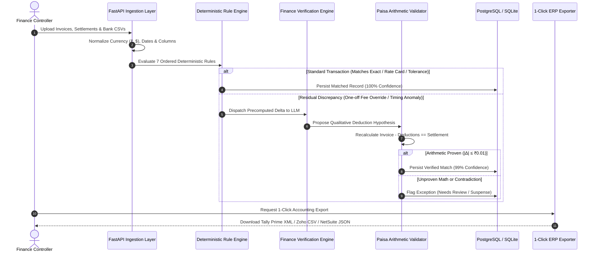
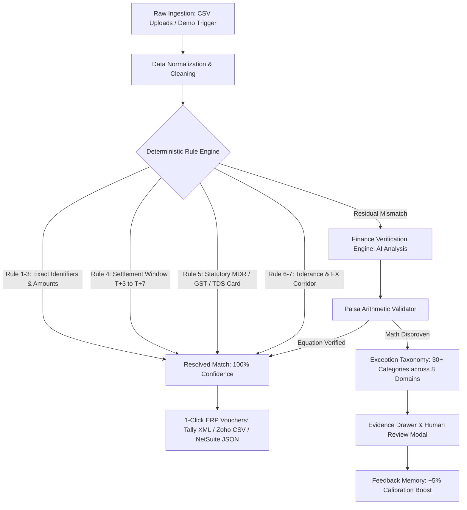
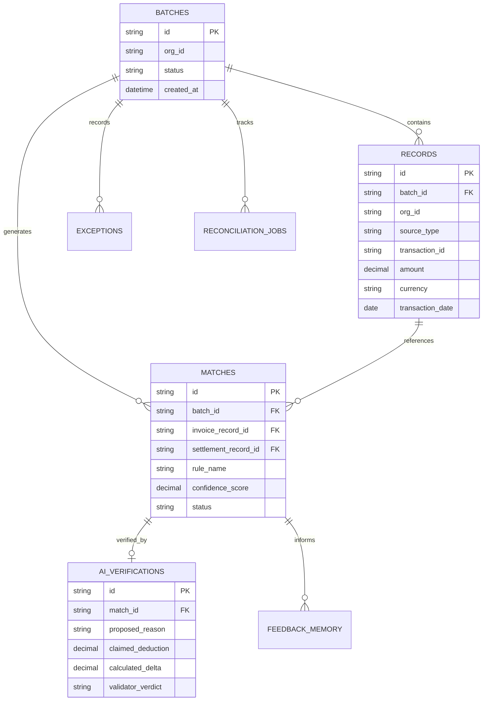
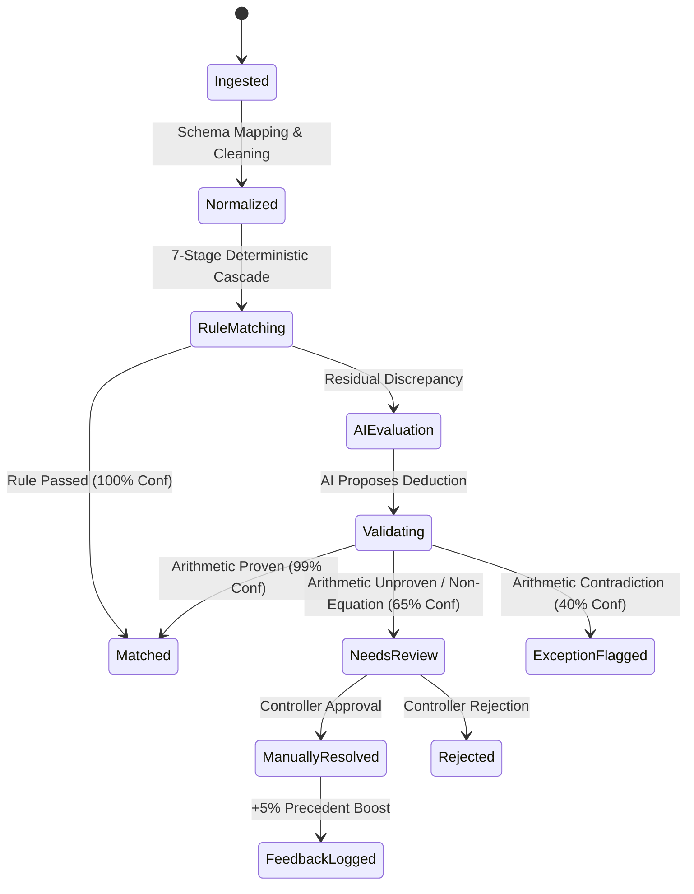
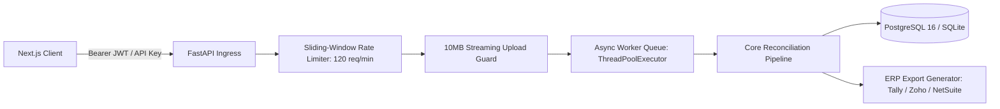

# ReconPilot 2.0: Autonomous AI Finance Controller

<div align="center">

[](https://github.com/ParthK0/ReconPilot/actions/workflows/ci.yml)
[](https://www.python.org/)
[](https://fastapi.tiangolo.com/)
[](https://nextjs.org/)
[](https://www.postgresql.org/)
[](https://opensource.org/licenses/MIT)

**Production-oriented 3-way financial reconciliation for high-velocity Indian digital commerce.**  
Reconciles ERP Invoices, Payment Gateway Settlements (Razorpay), and Commercial Bank Statements with deterministic accuracy, verified paisa arithmetic, and 1-click accounting journal exports.

[Quick Start](#quick-start) •
[Architecture & Visuals](#visual-architecture--workflows) •
[Core Principles](#core-design-principles) •
[Documentation Index](#documentation-index) •
[Benchmarks](#versioned-benchmark-reference)

</div>

---

## Overview

**ReconPilot 2.0** is an enterprise-inspired autonomous financial reconciliation engine designed for digital commerce merchants. Built specifically for the Indian payment ecosystem, it continuously resolves three disjoint data streams:

1. **ERP Invoices**: Billed order lines from internal accounting systems (Tally Prime, Zoho Books, SAP).
2. **Gateway Settlements**: Payouts, Merchant Discount Rate (MDR) deductions, 18% GST, and 1% Section 194-O TDS withholdings from payment gateways (Razorpay).
3. **Bank Statement Credits**: Lump-sum settlement credits and UTR reference feeds from commercial banks (HDFC, ICICI, Axis).

---

## Visual Architecture & Workflows

### 1. End-to-End Reconciliation Sequence


### 2. Reconciliation Workflow


### 3. Database Entity-Relationship (ER) Diagram


### 4. Record & Match State Transition


### 5. API Flow Architecture


---

## Core Design Principles

- **Rules Before AI**: The majority of standard payment flows are resolved deterministically using statutory rate cards and corridor rules. AI is invoked strictly for unresolvable anomalies.
- **Zero-Trust Arithmetic Validation**: AI self-reported confidence is discarded. An independent Python `Decimal` validator recalculates every claim to the exact paisa (₹0.01), structurally minimizing hallucination risk.
- **Closed-Loop Accounting**: Generates balanced double-entry accounting entries for Tally Prime XML (`<ENVELOPE>`), Zoho Books CSV, and NetSuite SuiteTalk JSON.
- **Active Feedback Memory**: Controller review decisions are stored as persistent precedents that dynamically calibrate confidence on future recurring discrepancies.
- **Live Cash Position Analytics**: Real-time visibility into Confirmed Cash, In-Flight Settlement Pipeline, Refund Reserves, and Expected Cash Tomorrow.

---

## Quick Start

### Option 1: Docker (Recommended)
```bash
git clone https://github.com/ParthK0/ReconPilot.git
cd ReconPilot
docker compose up --build
```
- **Web Dashboard**: [http://localhost:3000](http://localhost:3000)
- **Interactive API Docs**: [http://localhost:8000/docs](http://localhost:8000/docs)

### Option 2: Local Development
```bash
# Backend Setup
python -m venv .venv
.\.venv\Scripts\Activate.ps1   # Windows (or source .venv/bin/activate on Linux/macOS)
pip install -r requirements.txt
uvicorn backend.main:app --reload --port 8000

# Frontend Setup (in a separate terminal)
cd frontend
npm install
npm run dev
```

---

## Versioned Benchmark Reference

Performance figures are measured on the synthetic 100-record ground-truth test batch ([`backend/evaluation/score.py`](file:///e:/Razorpay/backend/evaluation/score.py)):

| Metric Category | Verified Benchmark | Context & Scope |
| :--- | :---: | :--- |
| **Pipeline Throughput** | `0.29s` core engine (`0.93s` wall clock) | 100 3-way records (Invoice + Settlement + Bank) |
| **Matching Precision** | `100.00%` (0 False Positives) | Zero incorrect matches created |
| **Matching Recall** | `100.00%` (0 Missed Matches) | All matchable records identified |
| **Benchmark Match Rate** | `92.00%` | 8 genuine exceptions correctly routed to review |
| **Manual Labor Saved** | `4.60 hours` per 100 txns | Based on conservative 3.0 min/record baseline |
| **Automated Test Suite** | `101 passed, 1 deselected, 0 failed` | Across 25 test suites (~12.8s runtime) |
| **Backend Coverage** | `79%` statement coverage | Across 3,560 backend statements (`pytest-cov`) |

---

## Documentation Index

For detailed engineering, architectural, and evaluation deep-dives:

- 📘 **[Developer Guide](DEVELOPER_GUIDE.md)**: File-by-file codebase guide covering every package, data flow, validator step, and error-handling pattern.
- 🏗️ **[Architectural Review](PROJECT_AUDIT.md)**: Independent Principal Software Architect due diligence covering scalability, security, performance, and testing.
- ⚖️ **[Simulated Panel Review](COMPREHENSIVE_PANEL_AUDIT.md)**: Comprehensive 17-dimension technical evaluation report.
- 🎯 **[Judge Assessment Report](RAZORPAY_JUDGE_AUDIT.md)**: Simulated evaluation report across the 10 track judging dimensions.

---

## License

Distributed under the MIT License. See `LICENSE` for details.
