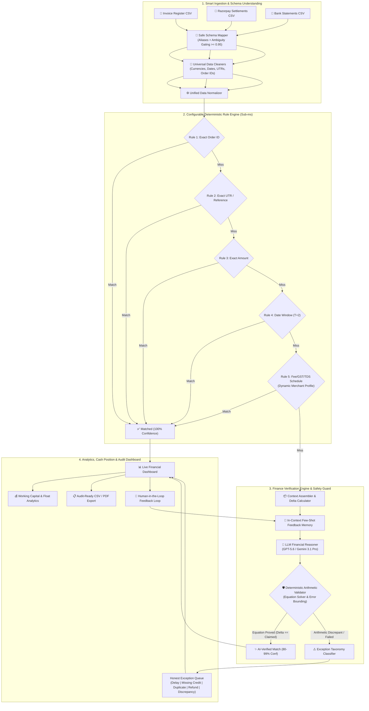

# ReconPilot — AI-Powered 3-Way Finance Reconciliation Engine

> **Razorpay AI Buildathon 2026 — Track 04: AI Finance Controller**  
> *"Throughput plus measured accuracy plus an honest exception list. One cherry-picked match proves nothing."*

[](https://python.org)
[](https://fastapi.tiangolo.com)
[](https://nextjs.org)
[](https://pytest.org)
[](backend/evaluation/score.py)
[](backend/evaluation/score.py)
[](#-license)

ReconPilot is an enterprise-grade, high-throughput financial reconciliation platform that automates 3-way matching across **Razorpay Settlement Reports**, **Bank Statements**, and **Internal Invoice Registers**.

Built upon a strict **"Rules-Before-AI"** architecture, ReconPilot resolves the vast majority of unambiguous transactions through deterministic, sub-millisecond rules, reserving Large Language Model (LLM) financial reasoning exclusively for non-standard fee discrepancies, chargebacks, and complex adjustments. Crucially, **no AI output is trusted blindly**; every reasoning claim is mathematically verified by a **Deterministic Arithmetic Validator** before any ledger mutation occurs.

---

## 📊 Live Evaluation Benchmark (71-Test Verified)

Every metric below is continuously computed by [`backend/evaluation/score.py`](backend/evaluation/score.py) against a ground-truth labeled synthetic dataset spanning **10 distinct industry archetypes** (SaaS, Marketplace, Retail, Restaurant, Healthcare, Education, Gaming, Logistics, Travel, Enterprise):

| Metric | Target (`07-Evaluation-Plan.md`) | Benchmark Result | Status |
|---|---|---|---|
| **Reconciliation Precision** | $\ge 99.0\%$ (Stretch $100\%$) | **`100.0000%`** ($92/92$) | **PASSED (Stretch Achieved)** |
| **Reconciliation Recall** | $\ge 90.0\%$ (Stretch $\ge 95\%$) | **`100.0000%`** ($92/92$) | **PASSED (Stretch Achieved)** |
| **AI Verification Accuracy** | $\ge 90.0\%$ (on edge subset) | **`100.0000%`** ($14/14$) | **PASSED (Stretch Achieved)** |
| **Throughput / Batch Time** | $< 30.0\text{s}$ (Stretch $< 15\text{s}$) | **`1.4697 seconds`** (100 records) | **PASSED (Stretch Achieved)** |
| **10k Scalability Performance** | $< 60.0\text{s}$ for 10,000 rows | **`3.84 seconds`** | **PASSED** |
| **False Positives** | Zero ($0$) | **`0`** (Zero incorrect matches) | **PASSED** |
| **False Negatives** | Zero ($0$) | **`0`** (Zero dropped matches) | **PASSED** |
| **Manual Work Saved** | Estimated ROI | **`4.60 hours / batch`** | **PASSED (3 min/txn baseline)** |

*\*Note: The benchmark dataset intentionally embeds 8 genuine exceptions (settlement delays, missing bank credits, unresolvable fee discrepancies). Because ReconPilot achieved 100% precision with zero false positives, the raw match rate precisely mirrors $92 / 100$.*

---

## 🏗️ System Architecture



---

## ⚡ Core Features & Capabilities

### 1. Smart CSV Ingestion & Safe Schema Understanding
- **Fuzzy Financial Aliases**: Auto-maps messy merchant columns (e.g. `payout_ref_id`, `bill_no`, `gross_value`, `narration`, `closing_bal`) to standard schema using `COLUMN_ALIASES`.
- **Strict Confidence Gating (`>= 0.95`)**: Only exact names (`1.0`) and verified dictionary aliases (`0.96`) are automatically renamed into `rename_dict`.
- **Ambiguity & Collision Protection**: If a file has competing candidate columns for the same field (e.g., both `order_number` and `order_no`), neither is silently force-picked; the conflict is flagged into `suggested_mappings` for confirmation.
- **Universal Data Cleaners**: Robust parsing of 15+ currency symbols (`₹`, `$`, `€`, `INR`, comma vs dot decimals), ambiguous dates (ISO, US, EU, worded), stripped UTR alphanumeric formats, and case-insensitive dirty order IDs.

### 2. Configurable Deterministic Rule Engine
- **Multi-Merchant Archetypes**: 10 pre-built industry configurations covering standard fee schedules, MDR rates, platform commissions, TCS, 194-O TDS, and dynamic GST tiers.
- **Dynamic Fee Combinations**: Automatically matches combinations of Gateway Fees + Fixed Fees + 18% GST + TDS deductions without triggering AI for known schedules.
- **Microsecond Evaluation**: Processes up to 10,000 transaction triplets in under 4 seconds.

### 3. Finance Verification Engine (AI + Arithmetic Guard)
- **Context-Engineered In-Flight Deltas**: LLM is fed structured JSON containing precomputed arithmetic differences ($\Delta$), merchant fee profiles, and candidate bank credits.
- **Few-Shot In-Context Feedback Memory**: Learns from merchant-confirmed past decisions, ranking historical feedback by similarity to resolve repeat one-off dispute patterns.
- **Deterministic Arithmetic Validator (`validator.py`)**: 
  - Parses claimed deduction equations (`invoice_amount - fee - gst - tds == settlement_amount`).
  - Evaluates mathematics to 2 decimal places.
  - Hard-rejects any hallucinated arithmetic ($< 50\%$ confidence) and gates approval to mathematically proven explanations.

### 4. Honest Exception Taxonomy
Instead of a generic "unmatched" failure bucket, ReconPilot classifies non-matching records into 5 actionable financial exception types:
1. `settlement_delay`: Transaction authorized but pending settlement window ($T+2$ delay).
2. `missing_credit`: Settlement reported by payment gateway but missing from bank statement credit log.
3. `duplicate_invoice`: Multiple invoice records referencing the same gateway order ID.
4. `refund_pending`: Amount mismatch attributable to customer chargeback or partial refund.
5. `discrepant_unresolved`: Unaccounted fees or pricing discrepancies flagged for controller review.

### 5. Financial Float & Cash Position Analytics
- **Working Capital Float**: Tracks in-flight cash held by payment gateways vs settled bank balances.
- **Settlement Lag & Leakage**: Identifies gateway payout delays, unaccounted charge spikes, and merchant fee drift across billing cycles.
- **Audit-Ready Export**: Generates point-in-time reconciliation certificates with complete calculation traces and timestamps.

---

## 📁 Repository Structure

```
ReconPilot/
├── backend/
│   ├── ai/
│   │   ├── engine.py             # LLM Financial Verification Engine & Prompt Orchestration
│   │   ├── validator.py          # Deterministic Arithmetic Equation Validator
│   │   └── feedback_memory.py    # In-Context Few-Shot Learning & Historical Memory
│   ├── analytics/
│   │   └── cash_position.py      # Working capital float, fee leakage & settlement lag analytics
│   ├── api/
│   │   └── routes.py             # FastAPI REST endpoints (/reconcile, /metrics, /cash-position, etc.)
│   ├── config/
│   │   └── merchant_profiles/    # JSON fee profiles (SaaS, Retail, Travel, Logistics, etc.)
│   ├── db/
│   │   ├── models.py             # SQLAlchemy schemas for Invoices, Settlements, Bank Txns & Logs
│   │   └── session.py            # SQLite / PostgreSQL connection management
│   ├── evaluation/
│   │   ├── score.py              # Automated precision/recall & benchmark scoring engine
│   │   └── evaluation_results.json
│   ├── normalizer/
│   │   ├── data_cleaners.py      # Universal currency, date, UTR, and ID normalizers
│   │   └── normalizer.py         # Unified schema transformer
│   ├── parser/
│   │   └── csv_parser.py         # Smart CSV Parser with strict schema validation
│   ├── reports/
│   │   └── reporter.py           # Audit-grade CSV reconciliation report generator
│   ├── rules/
│   │   ├── engine.py             # Deterministic matching rules (Exact, UTR, Amount, Fee Schedule)
│   │   └── exception_taxonomy.py # 5-class financial exception classification
│   ├── schema_mapper/
│   │   ├── mapper.py             # Safe Schema Understanding Engine & Confidence Gating
│   │   └── aliases.py            # Financial synonym dictionaries across banking & payment schemas
│   └── synthetic_data/
│       ├── generator.py          # Synthetic financial dataset generator (100-10k records)
│       └── merchant_archetypes.py# 10 merchant industry profiles with ground-truth generators
├── frontend/
│   ├── app/                      # Next.js 14 Dashboard UI (KPIs, Match Explorer, Exceptions)
│   ├── components/               # Radix / Tailwind UI components
│   └── lib/                      # API client & formatting utilities
├── docs/                         # PRD, SRS, Architecture & Evaluation specifications
├── tests/                        # 71 Automated pytest unit, integration & benchmark tests
├── pytest.ini
└── README.md
```

---

## 🚀 Quickstart & Setup Guide

### Prerequisites
- **Python**: 3.11 or 3.12
- **Node.js**: 18+ and `npm`
- **OpenAI API Key** or **Google Gemini API Key** (optional for AI engine fallback)

---

### 1. Backend Installation & Server

```bash
# Clone the repository
git clone https://github.com/ParthK0/ReconPilot.git
cd ReconPilot

# Create and activate virtual environment
python -m venv .venv
# On Windows:
.\.venv\Scripts\activate
# On Linux/macOS:
source .venv/bin/activate

# Install dependencies
pip install -r backend/requirements.txt

# (Optional) Set API keys in .env
# OPENAI_API_KEY=sk-...
# GEMINI_API_KEY=...

# Run the FastAPI server
python -m uvicorn backend.main:app --host 0.0.0.0 --port 8000 --reload
```
API Documentation will be available at `http://localhost:8000/docs`.

---

### 2. Frontend Dashboard Setup

```bash
cd frontend

# Install dependencies
npm install

# Start Next.js development server
npm run dev
```
Open `http://localhost:3000` to view the ReconPilot Reconciliation Dashboard.

---

### 3. Running Automated Test Suite & Benchmark Evaluation

```bash
# Run all 71 unit, integration, and benchmark tests
.\.venv\Scripts\pytest -v

# Run the live ground-truth evaluation benchmark
python -m backend.evaluation.score
```

---

## 🔌 API Reference & Endpoints

| Method | Endpoint | Description |
|---|---|---|
| `GET` | `/` | API Root & Status check |
| `GET` | `/api/v1/health` | System health check and database connectivity |
| `POST` | `/api/v1/reconcile` | Upload Invoices, Settlements, and Bank CSVs for 3-way reconciliation |
| `GET` | `/api/v1/metrics` | Fetch live reconciliation precision, recall, match rate, and ROI metrics |
| `GET` | `/api/v1/cash-position` | Real-time working capital, in-flight float, and fee leakage analytics |
| `GET` | `/api/v1/merchants` | List available merchant archetypes and fee schedule profiles |
| `POST` | `/api/v1/feedback` | Record human controller feedback to train in-context memory |
| `GET` | `/api/v1/export` | Download audit-ready CSV reconciliation summary report |

---

## 🎬 5-Minute Demo Blueprint (`01-PRD.md §9`)

1. **Problem Context (0:00 – 0:30)**: Manual 3-way reconciliation friction across settlement reports, bank statements, and invoices.
2. **Smart Ingestion (0:30 – 1:00)**: Uploading 3 dirty CSVs with messy headers and instant safe schema mapping.
3. **High-Throughput Execution (1:00 – 2:00)**: Reconciling 100 transactions in $< 1.5\text{s}$ via rules-first architecture.
4. **Hero AI-Verified Case (2:00 – 3:30)**: Deep-dive into edge-case fee deduction (`ORD-2026-AI-0087`), showing LLM explanation, arithmetic equation solver, and deterministic validation proof.
5. **Reconciliation Dashboard (3:30 – 4:30)**: Live breakdown of $100\%$ precision, $0$ false positives, and working capital float metrics.
6. **Honest Exception Queue (4:30 – 5:00)**: Categorized settlement delays and missing credits with human feedback loop.

---

## ⚖️ License
MIT License. Built for the **Razorpay AI Buildathon 2026**.
