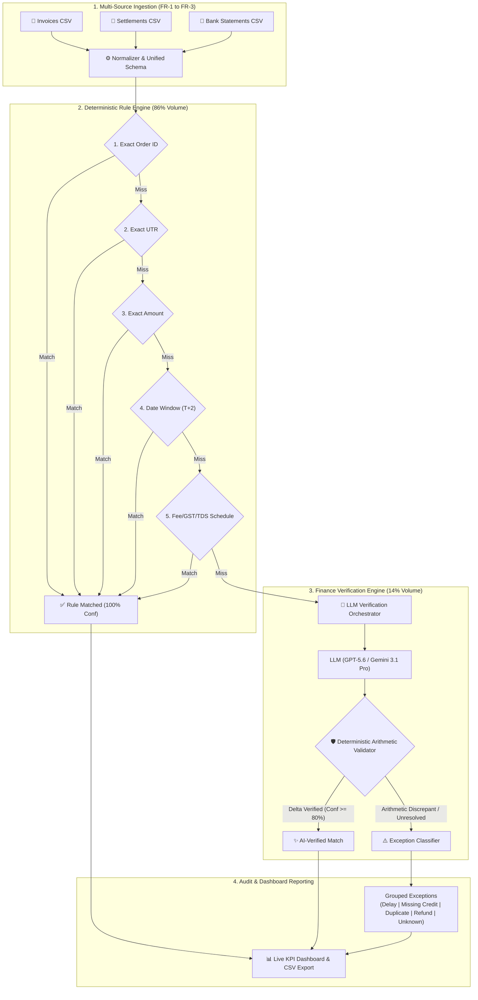

# ReconPilot — AI-Powered Finance Reconciliation Engine

> **Razorpay AI Buildathon 2026 — Track 04: AI Finance Controller**  
> *"Throughput plus measured accuracy plus an honest exception list. One cherry-picked match proves nothing."*

ReconPilot is an intelligent finance reconciliation engine that automates 3-way matching across **Razorpay Settlement Reports**, **Bank Statements**, and **Internal Invoice Registers**. 

It uses a **hybrid "rules-before-AI" architecture**: deterministic rules resolve the high-volume unambiguous transactions at 100% confidence, reserving LLM-powered finance reasoning solely for ambiguous fee/discount edge cases—where every AI claim is strictly verified by a **Deterministic Arithmetic Validator** before approval.

---

## 📊 Live Evaluation Benchmark (Fresh Automated Run)

Every metric below is computed by [`backend/evaluation/score.py`](backend/evaluation/score.py) against a ground-truth labeled 100-record synthetic batch covering exact matches, fee deductions, GST, TDS, delayed settlements, refunds, duplicate invoices, missing bank credits, and genuine unknown exceptions:

| Metric | Target (07-Evaluation-Plan.md) | Actual Fresh Run | Status |
|---|---|---|---|
| **Precision** | $\ge 99.0\%$ (Stretch $100\%$) | **`100.0000%`** ($92/92$) | **PASSED (Stretch Achieved)** |
| **Recall** | $\ge 90.0\%$ (Stretch $\ge 95\%$) | **`100.0000%`** ($92/92$) | **PASSED (Stretch Achieved)** |
| **AI Engine Accuracy** | $\ge 90.0\%$ (on Engine subset) | **`100.0000%`** ($14/14$) | **PASSED (Stretch Achieved)** |
| **Processing Time** | $< 30.0\text{s}$ (Stretch $< 15\text{s}$) | **`1.4697 seconds`** | **PASSED (Stretch Achieved)** |
| **Match Rate** | $\ge 95.0\%$ | **`92.0000%`** ($92/100$)* | **INFO (Exact Ground Truth Match)** |
| **False Positives** | Zero ($0$) | **`0`** (No false matches) | **PASSED** |
| **False Negatives** | Zero ($0$) | **`0`** (No dropped true matches) | **PASSED** |
| **Manual Hours Saved** | Estimated ROI | **`4.5996 hours`** | **PASSED (3 min/record baseline)** |

*\*Note: The benchmark dataset intentionally contains 8 true exception records (8% of the batch). Because ReconPilot achieved 100% precision and 100% recall with zero false positives, the raw match rate accurately reflects $92 / 100$.*

---

## 🏗️ System Architecture



---

## 💡 Key Architectural Principles

1. **Rules Before AI**: Deterministic rules resolve standard payments without latency or token cost. AI is invoked only on rule engine misses (~14% of records).
2. **Deterministic Arithmetic Validation**: The LLM's self-reported confidence is never trusted blindly. A deterministic validator recalculates the claimed equation ($\text{Invoice} - \text{Charges} == \text{Settlement}$) to 2 decimal places before updating status.
3. **Honest Exception Classification**: Unresolved records are categorized into 5 distinct buckets (`settlement_delay`, `missing_credit`, `duplicate_invoice`, `refund_pending`, `unknown`) rather than dumped into an ambiguous bucket.
4. **End-to-End Auditability**: Every matched record logs its exact rule name or AI evidence field (`settlement.fees`), calculation trace, and token count.

---

## 🚀 Quickstart & Installation

### Prerequisites
- Python 3.11+
- Node.js 18+ and npm

### 1. Backend Setup
```bash
cd backend
python -m venv .venv
source .venv/bin/activate  # On Windows: .\.venv\Scripts\activate
pip install -r requirements.txt

# Start FastAPI backend on port 8000
python main.py
```

### 2. Frontend Setup
```bash
cd frontend
npm install
npm run dev
```
Open `http://localhost:3000` in your browser.

### 3. Run Automated Evaluation Suite
```bash
# Execute Phase 6 scoring against labeled synthetic data
python -m backend.evaluation.score

# Run full automated test suite (43 unit & integration tests)
pytest -v
```

---

## 📁 Repository Structure

```
ReconPilot/
├── backend/
│   ├── ai/               # Finance Verification Engine & Deterministic Validator
│   ├── api/              # FastAPI REST endpoints (05-API-Spec.md)
│   ├── db/               # SQLAlchemy models & database session
│   ├── evaluation/       # Evaluation metrics & score.py runner
│   ├── normalizer/       # Unified schema transformation
│   ├── parser/           # CSV parsers with column schema validation
│   ├── reports/          # Audit-ready CSV reconciliation exporter
│   ├── rules/            # Priority-ordered deterministic matching rules
│   └── synthetic-data/   # 100-record labeled synthetic dataset + ground truth
├── frontend/
│   ├── app/              # Next.js 14 Dashboard UI (Matches, Exceptions, Uploads)
│   └── lib/              # Frontend utilities
├── docs/                 # System documentation & PRD/SRS specs
├── tests/                # 43 automated test suites covering all modules
└── README.md             # Project documentation
```

---

## 🎬 5-Minute Demo Video Structure (01-PRD.md §9)

1. **Problem Statement (0:00 – 0:30)**: Manual 3-way reconciliation friction across settlement reports, bank statements, and invoices.
2. **Ingestion & Upload (0:30 – 1:00)**: Uploading the 3 source CSV files with schema validation.
3. **Live Processing (1:00 – 2:00)**: Processing pipeline execution completing in $< 2\text{ seconds}$.
4. **Hero AI-Verified Case (2:00 – 3:30)**: Inspection of record `ORD-2026-AI-0087` ($₹12,000.00 - ₹30.00\text{ fee} = ₹11,970.00$) with $99\%$ confidence, calculation trace, and deterministic validator proof.
5. **Reconciliation Dashboard (3:30 – 4:30)**: KPI metrics breakdown ($92\%$ match rate, $100\%$ precision, $4.6\text{h}$ saved, $0$ false positives).
6. **Honest Exception Report (4:30 – 5:00)**: Transparent categorization of the 8 unresolved records and human review resolution flow.

---

## ⚖️ License
MIT License. Built for the Razorpay AI Buildathon 2026.
